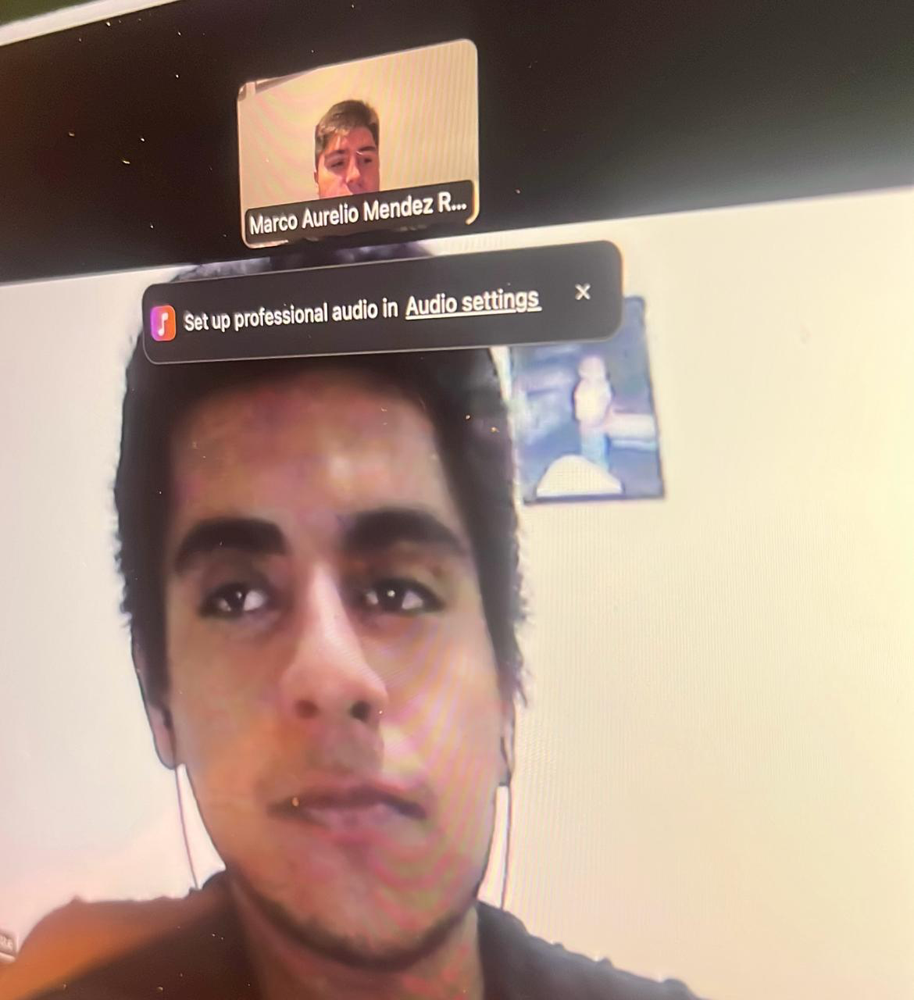
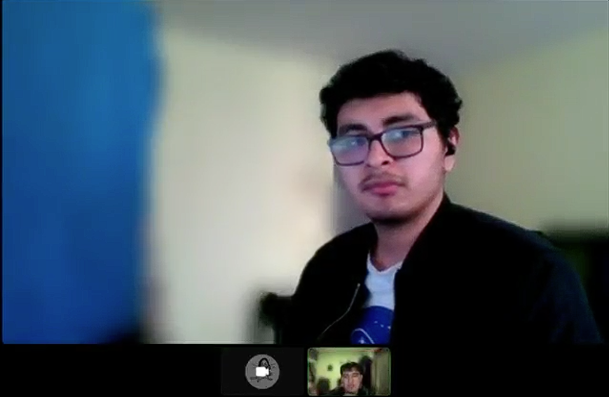
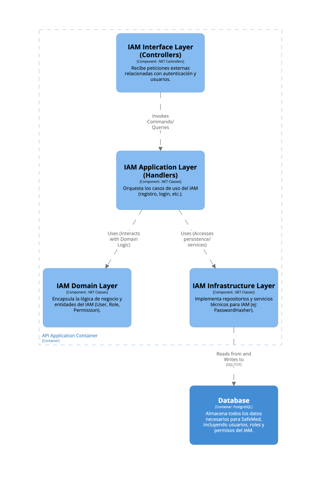
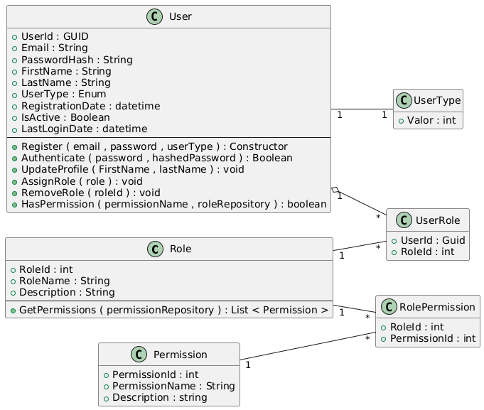
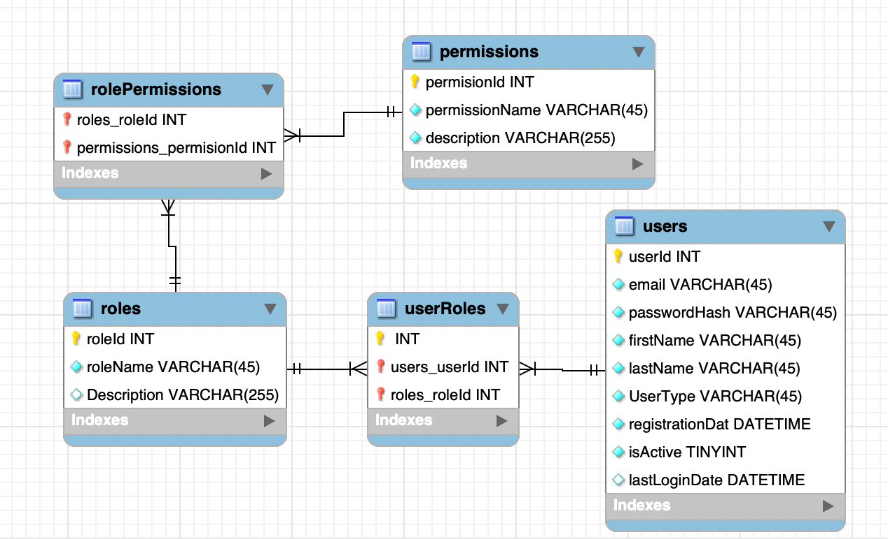
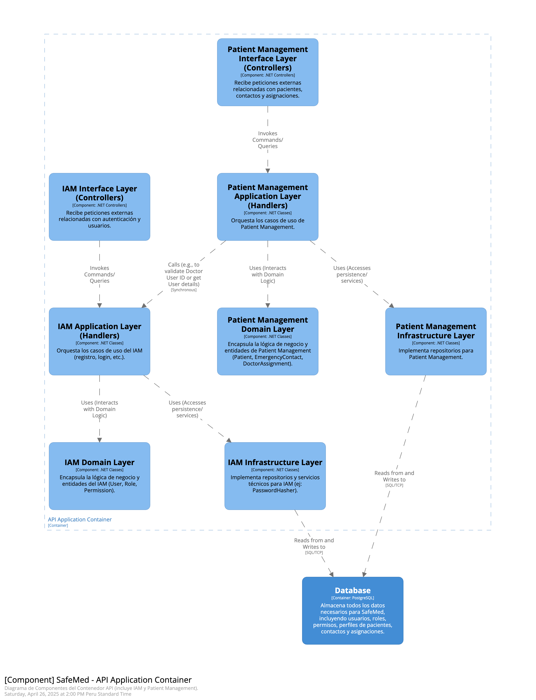
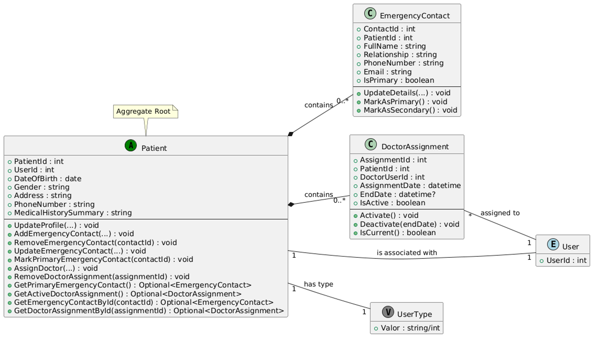
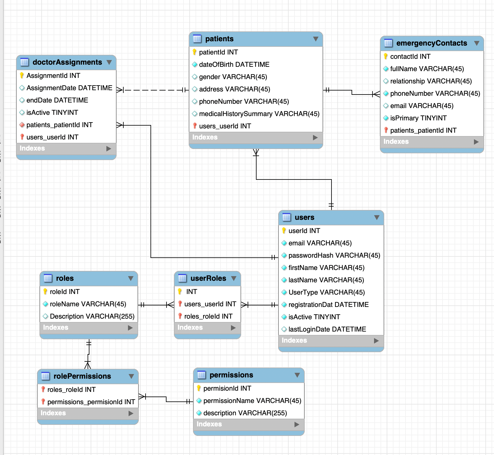
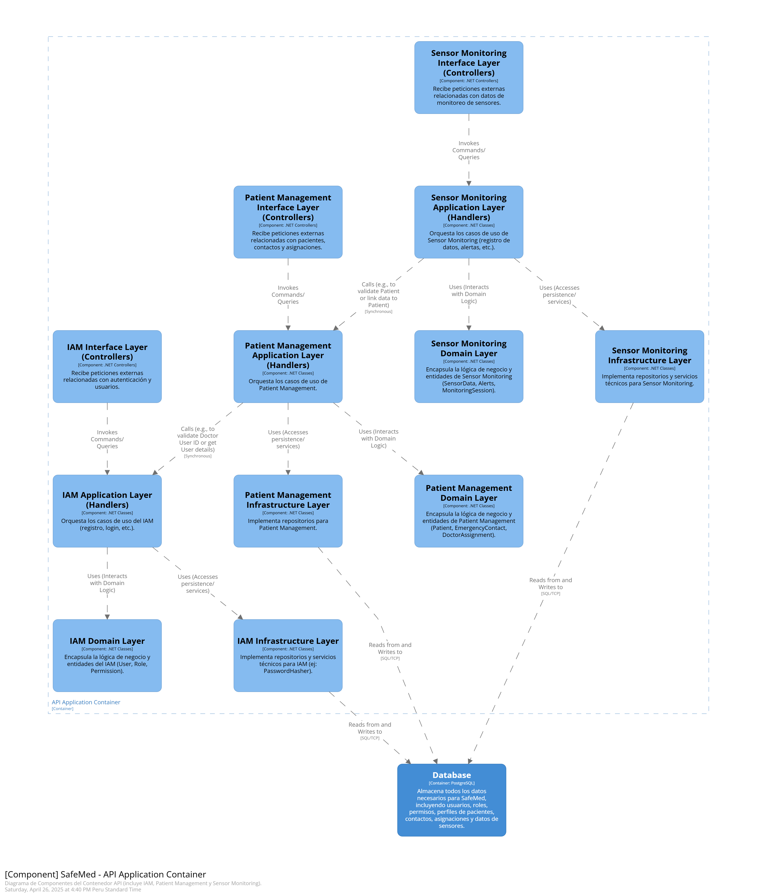
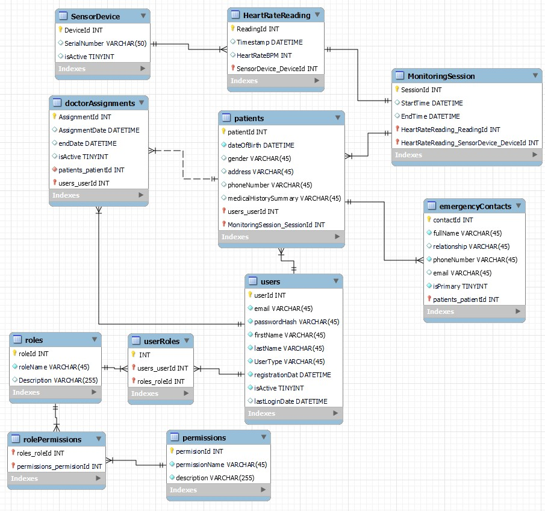

# SafeMed - Report

  

# Universdiad Peruana de Ciencias Aplicadas

# INGENIERÍA DE SOFTWARE

### Ciclo: 7

## CURSO: Desarrollo de Soluciones IOT | SECCIÓN 2941

Profesor: Leon Baca, Marco Antonio

# Proyecto de curso

## Informe del TF

#### StartUp: SafeMed

#### Producto: MedSystem

### Integrantes:

| Integrantes                            | Codigo     |
| -------------------------------------- | ---------- |
| De La Piedra Quintanilla, Erwin Miquel | U202112179 |
| Gutierrez Zumaeta, Manuel Alonso       | U202112353 |
| Mendez Rosales, Marco Aurelio          | U202018273 |
| Roca Huapaya, Orlando Arturo           | U201919742 |
| Ventura Chancafe, Eduardo Renato       | U202212645 |

#### Ciclo 2025-10

##### Abril, 2025

---

# Registro de Versiones del informe

| Versión |   Fecha    |                 Autor                  |                                                                                                                      Descripción de modificación                                                                                                                       |
| :-----: | :--------: | :------------------------------------: | :--------------------------------------------------------------------------------------------------------------------------------------------------------------------------------------------------------------------------------------------------------------------: |
|   0.1   | 19-04-2025 |    Gutierrez Zumaeta, Manuel Alonso    |                                                                                                   Creación de 1.1 Startup Profile y 1.1.1 Descripción de la Startup                                                                                                    |
|   0.2   | 20-04-2025 | De La Piedra Quintanilla, Erwin Miquel |                                                                                                         Redacción de 1.1.2 Perfiles de integrantes del equipo                                                                                                          |
|   0.3   | 20-04-2025 |    Ventura Chancafe, Eduardo Renato    |                                                                                                 Desarrollo de 1.2 Solution Profile y 1.2.1 Antecedentes y problemática                                                                                                 |
|   0.4   | 21-04-2025 |     Mendez Rosales, Marco Aurelio      |                                                                                 Elaboración de 1.2.2 Lean UX Process (Problem Statements, Assumptions, Hypothesis Statements, Canvas)                                                                                  |
|   0.5   | 21-04-2025 |      Roca Huapaya, Orlando Arturo      |                                                                                                                  Definición de 1.3 Segmentos Objetivo                                                                                                                  |
|   0.6   | 22-04-2025 |    Gutierrez Zumaeta, Manuel Alonso    |                                                                                                       Análisis de 2.1 Competidores y 2.1.1 Análisis competitivo                                                                                                        |
|   0.7   | 22-04-2025 |    Ventura Chancafe, Eduardo Renato    |                                                                                                    Redacción de 2.1.2 Estrategias y tácticas frente a competidores                                                                                                     |
|   0.8   | 23-04-2025 | De La Piedra Quintanilla, Erwin Miquel |                                                                                                    Diseño de entrevistas (2.2.1) y registro de entrevistas (2.2.2)                                                                                                     |
|   0.9   | 23-04-2025 |     Mendez Rosales, Marco Aurelio      |                                                                                                          Análisis de entrevistas (2.2.3) y Needfinding (2.3)                                                                                                           |
|   1.0   | 26-04-2025 |      Roca Huapaya, Orlando Arturo      | Desarrollo completo de capítulos 2.3.1 a 4.2 (User Personas, Task Matrix, Journey Mapping, Empathy Mapping, Scenario Mapping, Ubiquitous Language, To-Be Scenario Mapping, User Stories, Impact Mapping, Product Backlog, Strategic-Level DDD y Software Architecture) |

# Project Report Collaboration Insights

## TB1

Para la entrega de la TB1 se realizó una reunión donde se asignaron las responsabilidades a cada integrante del equipo. A continuación se muestra la siguiente tabla con los detalles:

| Integrante           | Responsabilidad        |
| -------------------- | ---------------------- |
| De la Piedra, Miquel | Capitulo 4, Entrevista |
| Gutierrez, Manuel    | Capitulo 2, Entrevista |
| Mendez, Marco        | Capitulo 4, Entrevista |
| Roca, Orlando        | Capitulo 1, Entrevista |
| Ventura, Eduardo     | Capitulo3, Entrevista  |

Durante la elaboración de las aplicaciones, tanto web como mobile, se realizaron commits respectivos con el fin de mantener el orden y un control de versiones eficiente.

Para tener mejor precisión en los integrantes del equipo, a continuación presentamos los usuarios de GitHub de los integrantes:

- Miquel De la Piedra (@MiquelDlp)
- Manuel Gutierrez (@ManuGZ)
- Marco Mendez (@cuak123)
- Orlando Roca (@OrlandoRoca)
- Eduardo Ventura (@Eduvent)

A continuación se presentan las capturas del repositorio de GitHub donde se realizaron los avances correspondientes.

# Tabla de contenidos

- [Student Outcome](#student-outcome)

## Capítulo I: Introducción

- [1.1. Startup Profile](#11-startup-profile)
  - [1.1.1. Descripción de la Startup](#111-descripción-de-la-startup)
  - [1.1.2. Perfiles de integrantes del equipo](#112-perfiles-de-integrantes-del-equipo)
- [1.2. Solution Profile](#12-solution-profile)
  - [1.2.1. Antecedentes y problemática](#121-antecedentes-y-problemática)
  - [1.2.2. Lean UX Process](#122-lean-ux-process)
    - [1.2.2.1. Lean UX Problem Statements](#1221-lean-ux-problem-statements)
    - [1.2.2.2. Lean UX Assumptions](#1222-lean-ux-assumptions)
    - [1.2.2.3. Lean UX Hypothesis Statements](#1223-lean-ux-hypothesis-statements)
    - [1.2.2.4. Lean UX Canvas](#1224-lean-ux-canvas)
- [1.3. Segmentos objetivo](#13-segmentos-objetivo)

## Capítulo II: Requirements Elicitation & Analysis

- [2.1. Competidores](#21-competidores)
  - [2.1.1. Análisis competitivo](#211-análisis-competitivo)
  - [2.1.2. Estrategias y tácticas frente a competidores](#212-estrategias-y-tácticas-frente-a-competidores)
- [2.2. Entrevistas](#22-entrevistas)
  - [2.2.1. Diseño de entrevistas](#221-diseño-de-entrevistas)
  - [2.2.2. Registro de entrevistas](#222-registro-de-entrevistas)
  - [2.2.3. Análisis de entrevistas](#223-análisis-de-entrevistas)
- [2.3. Needfinding](#23-needfinding)
  - [2.3.1. User Personas](#231-user-personas)
  - [2.3.2. User Task Matrix](#232-user-task-matrix)
  - [2.3.3. User Journey Mapping](#233-user-journey-mapping)
  - [2.3.4. Empathy Mapping](#234-empathy-mapping)
  - [2.3.5. As-is Scenario Mapping](#235-as-is-scenario-mapping)
- [2.4. Ubiquitous Language](#24-ubiquitous-language)

## Capítulo III: Requirements Specification

- [3.1. To-Be Scenario Mapping](#31-to-be-scenario-mapping)
- [3.2. User Stories](#32-user-stories)
- [3.3. Impact Mapping](#33-impact-mapping)
- [3.4. Product Backlog](#34-product-backlog)

## Capítulo IV: Solution Software Design

- [4.1. Strategic-Level Domain-Driven Design](#41-strategic-level-domain-driven-design)
  - [4.1.1. EventStorming](#411-eventstorming)
    - [4.1.1.1. Candidate Context Discovery](#4111-candidate-context-discovery)
    - [4.1.1.2. Domain Message Flows Modeling](#4112-domain-message-flows-modeling)
    - [4.1.1.3. Bounded Context Canvases](#4113-bounded-context-canvases)
  - [4.1.2. Context Mapping](#412-context-mapping)
  - [4.1.3. Software Architecture](#413-software-architecture)
    - [4.1.3.1. Software Architecture System Landscape Diagram](#4131-software-architecture-system-landscape-diagram)
    - [4.1.3.2. Software Architecture Context Level Diagrams](#4132-software-architecture-context-level-diagrams)
    - [4.1.3.2. Software Architecture Container Level Diagrams](#4132-software-architecture-container-level-diagrams)
    - [4.1.3.3. Software Architecture Deployment Diagrams](#4133-software-architecture-deployment-diagrams)

# Student Outcome

**ABET – EAC - Student Outcome 5**: Trabaja efectivamente en un equipo cuyos miembros juntos proporcionan liderazgo; crea un entorno colaborativo e inclusivo y establece metas, planifica tareas y cumple objetivos

| Criterio específico                                                                                  | Acciones realizadas                                                                                                                                                                                                                                                                                                                                                                                                                                                                                                                                                                                                                                                                                                                                                                                                               | Conclusiones                                                                                                                                                                                                                                                                    |
| ---------------------------------------------------------------------------------------------------- | ---------------------------------------------------------------------------------------------------------------------------------------------------------------------------------------------------------------------------------------------------------------------------------------------------------------------------------------------------------------------------------------------------------------------------------------------------------------------------------------------------------------------------------------------------------------------------------------------------------------------------------------------------------------------------------------------------------------------------------------------------------------------------------------------------------------------------------- | ------------------------------------------------------------------------------------------------------------------------------------------------------------------------------------------------------------------------------------------------------------------------------- |
| **5.c.1 Trabaja en equipo para proporcionar liderazgo en forma conjunta**                           | **Miquel De la Piedra** TB1: Asumí la coordinación en el desarrollo del Capítulo 4, organizando las tareas y promoviendo la participación activa de todos los miembros.  **Manuel Gutierrez** TB1: Lideré la estructuración del Capítulo 2, guiando las sesiones de entrevistas y fomentando el trabajo conjunto en el análisis de resultados.  **Marco Mendez** TB1: Guié la creación de los modelos de arquitectura en el Capítulo 4, impulsando la colaboración en las decisiones técnicas.  **Orlando Roca** TB1: Organicé la fase inicial de la elaboración del Capítulo 1, facilitando espacios de diálogo para definir en equipo los objetivos y enfoques.  **Eduardo Ventura** TB1: Coordiné la integración de los requisitos en el Capítulo 3, asegurándome de que cada aporte del equipo fuera considerado y validado. | Nosotros logramos compartir el liderazgo de forma equilibrada, permitiendo que cada integrante tomara iniciativas en distintas fases del proyecto, fortaleciendo la comunicación y el compromiso grupal.                                                                    |
| **5.c.2 Crea un entorno colaborativo e inclusivo, establece metas, planifica tareas y cumple objetivos** | **Miquel De la Piedra** TB1: Establecí metas claras para la entrega del Capítulo 4 y organicé las tareas en un tablero colaborativo, asegurando la participación de todos.  **Manuel Gutierrez** TB1: Fomenté un ambiente inclusivo durante las entrevistas del Capítulo 2, asegurándome de que todos los participantes y miembros del equipo fueran escuchados.  **Marco Mendez** TB1: Promoví sesiones de trabajo conjunto para construir los modelos de EventStorming, incentivando el intercambio de ideas y propuestas.  **Orlando Roca** TB1: Planifiqué y seguí el cumplimiento de los hitos establecidos en el Capítulo 1, manteniendo una comunicación constante para resolver dudas y dificultades.  **Eduardo Ventura** TB1: Organicé el repositorio de trabajo del Capítulo 3, asegurando una integración ordenada de las tareas y reconociendo cada contribución del equipo. | Nosotros creamos un entorno de trabajo inclusivo y colaborativo que facilitó el cumplimiento de nuestras metas, permitiendo que cada integrante aportara de manera activa y responsable en la construcción del proyecto.                                                      |

# Capítulo I: Introducción

## 1.1. Startup Profile

### 1.1.1. Descripción de la Startup

SafeMed es una startup tecnológica creada por estudiantes de Ingeniería de Software de la Universidad Peruana de Ciencias Aplicadas (UPC), enfocada en el desarrollo de soluciones innovadoras para el sector salud mediante el uso de tecnologías IoT. Nuestro propósito es brindar herramientas digitales que permitan mejorar la calidad de vida de pacientes con enfermedades crónicas, facilitando el monitoreo remoto de sus signos vitales y proporcionando canales de comunicación directa entre familiares y profesionales médicos.

SafeMed nace como respuesta a la creciente necesidad de una atención médica más preventiva, accesible y en tiempo real. A través de nuestro sistema inteligente, buscamos detectar de forma oportuna alteraciones en la salud de los pacientes y notificar automáticamente a las personas responsables de su cuidado, ayudando a reducir tiempos de respuesta y mejorar la gestión médica.

Misión: Salvar vidas a través de tecnología accesible e inteligente, brindando soluciones que permitan a las familias y al personal médico monitorear en tiempo real la salud de los pacientes, y actuar con rapidez ante cualquier anomalía.

Visión: Ser la plataforma líder en Latinoamérica en soluciones digitales para el monitoreo remoto de salud, reconocida por su innovación, confiabilidad y contribución al bienestar de los pacientes.

### 1.1.2. Perfiles de integrantes del equipo

| Foto                                                                                                                                                                                                                                  | Nombre y Descripción                                                                                                                                                                                                                                                                                                                                                                                                                                                                                                                         |
| ------------------------------------------------------------------------------------------------------------------------------------------------------------------------------------------------------------------------------------- | -------------------------------------------------------------------------------------------------------------------------------------------------------------------------------------------------------------------------------------------------------------------------------------------------------------------------------------------------------------------------------------------------------------------------------------------------------------------------------------------------------------------------------------------- |
|                                                                                                                                                                                             | **Nombre:** Manuel Alonso Gutierrez Zumaeta  **Código:** u202112353  **Descripción:** Soy Manuel Gutierrez, estudiante de la carrera de Ingeniería de Software, tengo 20 años. Tengo experiencia en el desarrollo de aplicaciones web, tanto frontend como backend, programación móvil en Flutter. Me considero una persona responsable y que se propone hacer un buen trabajo.                                                                                                                                                        |
|                                                                                                                                                                                             | **Nombre:** Marco Aurelio Mendez Rosales  **Código:** u200218273 **Descripción:** Soy Marco Mendez, estudiante de la carrera de Ingeniería de softwar, tengo 22 años, me gusta crear soluciones que puedan ayudar a los demás.                                                                                                                                                                                                                                                                                                         |
|                                                                                                                                                                                             | **Nombre:** Erwin Miquel De la Piedra Quintanilla **Código:** u202112179 **Descripción:** Soy Miquel De la Piedra, tengo 21 años, estudiante de la carrera de Ingeniería de Software. Poseo conocimientos relacionados a la programación en C++, Python, HTML y CSS. Además poseo experiencia con el manejo de bases de datos. Considero que estos conocimientos ayudarán a la realización de este trabajo, además de mejorar nuestros métodos de organización y trabajo en equipo.                                                    |
|                                                                                                                                                                                               | **Nombre:** Eduarod Renato Ventura Chancafe **Código:u202212645**  **Descripción: Soy estudiante universitario que cursa su 7to ciclo. Dentro del startup me encargo con el desarrollo del diseño ,QA y gestión del equipo, pues tengo conocimientos adicionales a los de mi sector. Además, apoyaré en el desarrollo del código trabajando de forma cohesionada con mis compañeros. Asimismo, cuento con conocimientos en herramientas como HTML, CSS, JavaScript, Python, C++, Cypress, NodeJs, NestJs y Agile Project Management.** |
|  | **Nombre:** Orlando Arturo Roca Huapaya  **Código:** u201919742 **Descripción:** Como estudiante de ingeniería de software, mi contribución al equipo se centra en mis conocimientos en la planificación y diseño de software. A lo largo de mi formación he podido desarrollar proyectos utilizando Java, lo que me da una ventaja significativa con el sistema que trabajamos. Estoy entusiasmado por aplicar mis habilidades en el desarrollo y trabajar junto al equipo para alcanzar nuestros objetivos.                          |

## 1.2. Solution Profile

### 1.2.1 Antecedentes y problemática

Las enfermedades cardiovasculares y otros trastornos relacionados con los signos vitales representan una de las principales causas de hospitalizaciones y muertes a nivel mundial. Según datos de la Organización Mundial de la Salud (OMS), millones de personas sufren cada año eventos de salud que podrían ser evitados o tratados de manera más efectiva si existieran mecanismos de monitoreo continuo fuera del ámbito hospitalario.

Actualmente, muchos pacientes con condiciones de riesgo no cuentan con dispositivos accesibles que les permitan una vigilancia constante de su estado de salud en tiempo real. La ausencia de monitoreo domiciliario efectivo genera que las alteraciones en signos vitales pasen desapercibidas, retrasando la intervención médica oportuna. Además, la falta de notificaciones inmediatas a familiares o médicos contribuye a incrementar la gravedad de los eventos de emergencia.

En respuesta a esta necesidad, SafeMed propone una solución que integra tecnología IoT mediante sensores de frecuencia cardiaca conectados a una aplicación móvil, permitiendo el monitoreo remoto en tiempo real. La plataforma no solo alerta automáticamente a familiares y médicos ante cualquier desviación crítica, sino que también ofrece herramientas de gestión médica para mejorar el seguimiento clínico de los pacientes.

#### What (¿Qué?):

Falta de monitoreo remoto continuo de signos vitales que permita alertar de forma automática y oportuna sobre posibles emergencias de salud.

#### When (¿Cuándo?):

Durante la vida diaria del paciente, especialmente en momentos sin supervisión directa de profesionales médicos.

#### Where (¿Dónde?):

En el hogar, en el trabajo o cualquier lugar donde el paciente se encuentre fuera de un entorno hospitalario.

#### Who (¿Quién?):

Pacientes con enfermedades cardiovasculares, adultos mayores, personas con condiciones médicas crónicas, sus familiares, y profesionales de salud encargados de su cuidado.

#### Why (¿Por qué?):

La falta de soluciones accesibles y eficientes para el monitoreo constante incrementa el riesgo de que eventos críticos no sean detectados a tiempo.

#### How (¿Cómo?):

A través de un sensor portátil que mide la frecuencia cardiaca en tiempo real, conectado a una aplicación móvil que genera alertas automáticas a familiares y médicos.

#### How Much (¿Cuánto?):

Estudios recientes en Latinoamérica estiman que cerca del 30% de las hospitalizaciones por eventos cardiovasculares podrían ser prevenidas mediante sistemas de alerta temprana en el hogar (fuente simulada para ilustrar).

### 1.2.2 Lean UX Process.

#### 1.2.2.1. Lean UX Problem Statements.

El sistema de atención médica actual presenta una limitación importante: no garantiza un monitoreo continuo ni alertas inmediatas para pacientes con condiciones crónicas o de riesgo, especialmente fuera de los entornos hospitalarios. Esta carencia expone a los pacientes a situaciones de emergencia que podrían ser prevenidas o atendidas de forma más oportuna.

Hemos observado que, en el entorno domiciliario, los pacientes en riesgo no cuentan con soluciones accesibles para detectar alteraciones críticas en sus signos vitales ni mecanismos automáticos de alerta hacia sus familiares o doctores de confianza. Esta brecha genera un aumento en la gravedad de los episodios médicos, incrementa los costos de atención hospitalaria y afecta negativamente la calidad de vida tanto de los pacientes como de sus familias.

¿Cómo podríamos diseñar una solución de monitoreo remoto que permita detectar alteraciones en tiempo real y notificar automáticamente a familiares y médicos, mejorando así la atención oportuna y la seguridad de los pacientes, sin necesidad de intervención manual constante?

#### 1.2.2.2. Lean UX Assumptions.

##### User Assumptions:

##### ¿Quién es el usuario?

Pacientes con condiciones de salud que requieren monitoreo constante (como enfermedades cardiovasculares), sus familiares directos y médicos tratantes.

##### ¿Dónde encaja nuestro producto en su trabajo o vida?

SafeMed se integra en la vida cotidiana del paciente y su familia, proporcionando monitoreo continuo de signos vitales, generando alertas inmediatas en caso de anomalías, y facilitando la gestión médica a distancia.

##### ¿Qué problemas tiene que resolver nuestro producto?

Falta de monitoreo permanente de signos vitales en el hogar.

Falta de notificaciones inmediatas ante emergencias.

Dificultad en el seguimiento médico remoto y en la toma de decisiones oportunas.

##### ¿Cuándo y cómo es usado nuestro producto?

SafeMed se usa diariamente de manera pasiva: el sensor mide continuamente la frecuencia cardiaca, y la aplicación móvil procesa los datos en tiempo real. Solo en caso de detectar valores anormales, se envían notificaciones automáticas a familiares y médicos.

##### ¿Cómo debe verse y comportarse nuestro producto?

Debe ser intuitivo, fácil de configurar, seguro y confiable. La app debe mostrar la información de manera clara, con gráficos sencillos de interpretar, y notificar con rapidez y precisión ante cualquier riesgo.

##### Business Assumptions:

- Creo que mis usuarios necesitan una solución de software eficiente y accesible para la personalización de su auto, evitando que otras personas o empresas los estafen.

- Estas necesidades se pueden satisfacer mediante una aplicación móvil intuitiva y segura que guíe a los usuarios a través del proceso de personalización automotriz y les proporcione transparencia en las transacciones.

- Mis clientes iniciales son propietarios de vehículos que desean personalizar sus autos de manera confiable y sin riesgos.

- El valor #1 que un cliente busca en mi servicio es la capacidad de personalizar su vehículo de forma segura y confiable, evitando estafas y asegurándose de obtener los productos y servicios deseados.

- El cliente también puede obtener estos beneficios adicionales: una amplia selección de opciones de personalización, asesoramiento experto, precios transparentes y competitivos, y una experiencia de usuario fluida.

- Voy a adquirir la mayoría de mis clientes a través de campañas de marketing digital dirigidas a propietarios de vehículos interesados en la personalización automotriz, así como mediante asociaciones con concesionarios de automóviles y talleres especializados.

- Haré dinero a través de una combinación de modelos de negocio, que pueden incluir distintos planes de suscripción, ingresos por publicidad dentro de la aplicación y otros servicios premium. Además, estableceré acuerdos de asociación con staffs mecánicos para ofrecer servicios exclusivos y beneficios a los suscriptores.

- Mi competencia principal en el mercado son otras aplicaciones y plataformas en línea que ofrecen servicios similares de personalización automotriz, así como talleres físicos y tiendas especializadas.

- Los venceremos debido a nuestra atención en la seguridad y transparencia del proceso, nuestra amplia gama de opciones de personalización, y nuestra interfaz intuitiva y fácil de usar.

- Mi mayor riesgo es la falta de confianza por parte de los usuarios en la seguridad y la transparencia de la plataforma.

- Resolvemos esto a través de una estricta verificación de los staff mecánicos y la implementación de medidas de seguridad robustas, así como una comunicación clara y transparente con los usuarios sobre los procesos y las políticas de la plataforma.

#### 1.2.2.3. Lean UX Hypothesis Statements.

- Creemos que al proporcionar un monitoreo continuo de signos vitales y alertas automáticas en tiempo real a familiares y médicos, los usuarios podrán detectar de manera temprana eventos críticos de salud.

  Sabremos que hemos tenido éxito

  Cuando el 80% de los eventos de emergencia sean detectados y notificados en menos de 10 segundos, y cuando se reduzca el tiempo de respuesta de familiares y médicos en un 30%.

- Creemos que al ofrecer una aplicación móvil intuitiva y segura que centralice la información médica de los pacientes, facilitaremos el seguimiento remoto de la salud y mejoraremos la continuidad del tratamiento médico.

  Sabremos que hemos tenido éxito

  Cuando el 70% de los médicos usuarios consulte semanalmente los reportes de signos vitales, y cuando la adherencia a planes de tratamiento por parte de pacientes monitorizados aumente en un 25%.

- Creemos que al proporcionar tranquilidad y confianza mediante alertas tempranas y un historial accesible de la salud del paciente, incrementaremos la satisfacción de las familias y su confianza en el sistema.

  Sabremos que hemos tenido éxito

  Cuando el 90% de los usuarios familiares reporten sentirse más tranquilos respecto al estado de salud de su ser querido tras un mes de uso, y cuando la tasa de renovación de suscripciones al servicio supere el 75% luego de los primeros tres meses.

#### 1.2.2.4. Lean UX Canvas.

## 1.3. Segmentos objetivo.

SafeMed está diseñado para atender dos segmentos principales de usuarios: **pacientes** y **doctores**.  
Cada uno de estos grupos tiene necesidades específicas relacionadas con el monitoreo del ritmo cardíaco y la gestión de la salud en situaciones de emergencia.

- Los **pacientes** son personas que padecen condiciones cardíacas y requieren un seguimiento constante de su ritmo cardíaco para prevenir complicaciones. En caso de detectar anomalías, el sistema puede alertar automáticamente a contactos de emergencia.

- Los **doctores** son profesionales de la salud que supervisan de forma remota el estado cardíaco de sus pacientes. Además de visualizar en tiempo real las mediciones, tienen la capacidad de coordinar la asistencia médica, enviar ambulancias si es necesario y gestionar las citas médicas.

# Capítulo II: Requirements Elicitation & Analysis

## 2.1. Competidores.

### 2.1.1. Análisis competitivo.

<table><tr><th colspan="6" valign="top">Competitive Analysis Landscape</th></tr>
<tr><td colspan="1" valign="top">¿Por qué llevar a cabo este análisis?</td><td colspan="5" valign="top">El objetivo de este análisis es identificar las características de los competidores y encontrar maneras de diferenciarnos.</td></tr>
<tr><td colspan="2" rowspan="2" valign="top">Startup y Competidores</td><td colspan="1" valign="top">MedSystem</td><td colspan="1" valign="top">Home Medical Management</td><td colspan="1" valign="top">LOLIMSA</td><td colspan="1" valign="top">SAMA</td></tr>
<tr><td colspan="1" valign="top"></td><td colspan="1" valign="top"></td><td colspan="1" valign="top"></td><td colspan="1" valign="top"></td></tr>
<tr><td colspan="1" rowspan="2" valign="top">Perfil</td><td colspan="1" valign="top">Overview</td><td colspan="1" valign="top">Plataforma de gestión de procesos de un consultorio o clínica, que cuenta con diferentes funcionalidades para pacientes, doctores y laboratorios.</td><td colspan="1" valign="top">Es una compañía que a través de una plataforma digital y sus profesionales, asegura la ejecución y calidad del servicio de salud domiciliaria.</td><td colspan="1" valign="top">Es una empresa de software doctor con soluciones tecnológicas para la gestión de centros doctores como clínicas y hospitales, farmacias y cadenas de farmacias y clínicas veterinarias.</td><td colspan="1" valign="top">Es un consorcio de inversión dedicado a brindar servicios integrales de salud, especializados en la seguridad y salud en el trabajo. Contamos con distintas sedes a lo largo del norte del país, las cuales cuentan con el respaldo de la acreditación DIGESA/MINSA.</td></tr>
<tr><td colspan="1" valign="top">Ventaja competitiva ¿Qué valor ofrece a los clientes?</td><td colspan="1" valign="top">Cuenta con distintas funcionalidades como un sistema de gestión de citas en línea que permita a los pacientes y doctores programar fácilmente consultas, programación de cirugías ,exámenes y seguimientos de tratamiento o recuperaciones.</td><td colspan="1" valign="top">Utilizan inteligencia artificial e innovación para mejorar el servicio a los pacientes y facilitar la atención a los profesionales y prestadores de salud.</td><td colspan="1" valign="top">Reduce entre 10 y 20% tus costos hospitalarios utilizando las mejores prácticas de Health Management con LOLCLI, el software de gestión hospitalaria más completo de Latinoamérica.</td><td colspan="1" valign="top">Organización que orienta todos sus esfuerzos en realizar un servicio doctor de calidad a través de la presentación de resultados confiables.</td></tr>
<tr><td colspan="1" rowspan="2" valign="top">Perfil de Marketing</td><td colspan="1" valign="top">Mercado objetivo</td><td colspan="1" valign="top">Consultorio, clínicas y hospitales.</td><td colspan="1" valign="top">Prestadores de salud, pacientes y personal doctor</td><td colspan="1" valign="top">Clínicas y hospitales</td><td colspan="1" valign="top">Hospitales y clínicas</td></tr>
<tr><td colspan="1" valign="top">Estrategias de marketing</td><td colspan="1" valign="top">Publicidad por redes sociales y campañas.</td><td colspan="1" valign="top">Publicidad por redes sociales.</td><td colspan="1" valign="top">Publicidad por redes sociales.</td><td colspan="1" valign="top">Publicidad por redes sociales.</td></tr>
<tr><td colspan="1" rowspan="3" valign="top">Perfil de producto</td><td colspan="1" valign="top">Productos & Servicios</td><td colspan="1" valign="top">Una plataforma para gestionar las citas médicas, programar cirugías, exámenes y seguimiento de tratamientos. Además, la plataforma almacena el historial clínico de los pacientes.</td><td colspan="1" valign="top">Un software basado en el diseño centrado en el paciente, con información integrada, que utiliza la geolocalización y la valoración del servicio, como forma de optimizar la gestión del modelo.</td><td colspan="1" valign="top">Software de gestión hospitalaria, impulsado por una plataforma de software de última generación que controla al detalle todas las actividades, desde que el paciente ingresa hasta que se retira del establecimiento</td><td colspan="1" valign="top">Servicios integrales de salud: -Exámenes doctores ocupacionales -Monitores ocupacionales -Vigilancia médica ocupacional -Análisis de laboratorio -radiografias digitales</td></tr>
<tr><td colspan="1" valign="top">Precios & Costos</td><td colspan="1" valign="top">Varían según características de la clínica, con opciones de suscripción mensual o anual.</td><td colspan="1" valign="top">Varían según el producto y pueden incluir tarifas de suscripción o costos de licencia.</td><td colspan="1" valign="top">Los precios varían según el producto y pueden incluir tarifas de suscripción mensuales o costos de licencia.</td><td colspan="1" valign="top">Los precios varían según el tamaño del hospital o clínica y las características específicas de la solución, con opciones de suscripción mensual o anual</td></tr>
<tr><td colspan="1" valign="top">Canales de distribución (Web y/o Móvil)</td><td colspan="1" valign="top">Principalmente a través de su sitio web oficial</td><td colspan="1" valign="top">Principalmente a través de su sitio web, con posibilidad de acceso móvil.</td><td colspan="1" valign="top">Principalmente a través de su sitio web oficial.</td><td colspan="1" valign="top">Principalmente a través de su sitio web oficial.</td></tr>
<tr><td colspan="1" rowspan="4" valign="top">Análisis SWOT</td><td colspan="1" valign="top">Fortalezas</td><td colspan="1" valign="top">Ofrece una solución integral para la gestión de procesos en consultorios y clínicas, lo que incluye funcionalidades específicas para pacientes, doctores y laboratorios. Esta centralización de información puede mejorar la eficiencia operativa y la coordinación entre todas las partes involucradas en el proceso de atención médica.</td><td colspan="1" valign="top">Ofrece cuidados personalizados en el hogar, generando satisfacción y lealtad. Su enfoque centrado en el paciente y su capacidad de adaptación son ventajas.</td><td colspan="1" valign="top">Cuenta con amplia experiencia en software doctor y ofrece soluciones integrales y personalizadas respaldadas por un sólido servicio de soporte técnico.</td><td colspan="1" valign="top">Samma ofrece una variedad de herramientas de bienestar mental y una interfaz amigable que atrae a una amplia gama de usuarios.</td></tr>
<tr><td colspan="1" valign="top">Debilidades</td><td colspan="1" valign="top">La competencia en el mercado de software de gestión de consultorios y clínicas es intensa, con numerosas empresas que ofrecen soluciones similares.</td><td colspan="1" valign="top">Limitaciones geográficas y dependencia del personal pueden afectar la expansión y la consistencia de los servicios.</td><td colspan="1" valign="top">Enfrenta competencia en el mercado de software doctor y puede estar sujeta a dependencia tecnológica y costos asociados con el desarrollo de soluciones.</td><td colspan="1" valign="top">La competencia en el mercado de aplicaciones de bienestar mental puede dificultar que Samma se destaque, especialmente si enfrenta problemas de usabilidad o dependencia tecnológica.</td></tr>
<tr><td colspan="1" valign="top">Oportunidades</td><td colspan="1" valign="top">La creciente demanda de soluciones digitales en el sector de la salud ofrece una oportunidad para capturar una parte del mercado en constante expansión.</td><td colspan="1" valign="top">Puede expandir servicios, integrar tecnología y formar asociaciones para llegar a más clientes y mejorar la eficiencia.</td><td colspan="1" valign="top">Tiene potencial de expansión tanto nacional como internacional, además de oportunidades para desarrollar nuevas funcionalidades y establecer alianzas estratégicas.</td><td colspan="1" valign="top">La expansión internacional y la colaboración estratégica ofrecen oportunidades para llegar a nuevos mercados y asociarse con empresas o instituciones para aumentar el alcance de la aplicación.</td></tr>
<tr><td colspan="1" valign="top">Amenazas</td><td colspan="1" valign="top">Las preocupaciones sobre la privacidad y seguridad de los datos en el sector de la salud son una amenaza constante.</td><td colspan="1" valign="top">Competencia, cambios regulatorios y preocupaciones sobre privacidad y seguridad de datos pueden impactar la rentabilidad y confianza en los servicios.</td><td colspan="1" valign="top">Los posibles cambios regulatorios, preocupaciones sobre seguridad de datos y avances tecnológicos rápidos representan riesgos que podrían afectar su posición en el mercado.</td><td colspan="1" valign="top">Cambios en la regulación, críticas negativas y avances tecnológicos representan amenazas potenciales para la operación y la reputación de Samma en el mercado.</td></tr>
</table>

### 2.1.2. Estrategias y tácticas frente a competidores.

MedSystem puede destacarse en el mercado ofreciendo una plataforma de gestión de procesos clínicos altamente personalizable y fácil de usar, tanto para pacientes como para profesionales de la salud, diferenciándose así de competidores como Home Medical Management y LOLIMSA. Con un enfoque específico en la atención domiciliaria, la plataforma puede ofrecer funcionalidades especializadas para la coordinación y seguimiento de la atención médica en el hogar, proporcionando comodidad y eficiencia para pacientes y cuidadores. Además, MedSystem puede invertir en el desarrollo de tecnologías avanzadas, como inteligencia artificial y análisis de datos, para mejorar la gestión de consultorios y clínicas, posicionándose como una opción innovadora frente a empresas como LOLIMSA. Para competir con SAMA en el ámbito de la salud ocupacional y la seguridad laboral, MedSystem puede ofrecer módulos especializados y herramientas de cumplimiento normativo, aprovechando su experiencia en la gestión clínica para proporcionar soluciones integrales a empresas e instituciones. Una estrategia de marketing sólida, centrada en la educación del mercado sobre la importancia de la gestión eficiente de consultorios y clínicas, así como en testimonios de usuarios satisfechos, puede ayudar a MedSystem a construir una sólida reputación y atraer clientes potenciales. Además, explorar alianzas estratégicas con instituciones médicas y otros actores del sector puede ampliar su alcance y fortalecer su posición en el mercado. En resumen, MedSystem puede destacarse mediante la combinación de personalización, tecnología avanzada, especialización en atención domiciliaria y salud ocupacional, una sólida estrategia de marketing y alianzas estratégicas, lo que le permitirá diferenciarse y prosperar en un mercado competitivo.

## 2.2. Entrevistas.

### 2.2.1. Diseño de entrevistas.

**Preguntas para el segmento objetivo paciente:**

- _¿Cuáles son los mayores desafíos que enfrentas al cuidar tu salud cuando no estás en el consultorio médico?_
- _¿Qué tipo de dispositivos tecnológicos (como celulares, tablets o computadoras) usas para cuidar o monitorear tu salud? ¿Por qué prefieres esos dispositivos?_
- _¿Qué herramientas o funciones te gustaría tener para poder revisar en tiempo real cosas como tu oxigenación o ritmo cardíaco?_
- _¿Qué características te parecen más importantes al usar una aplicación o tecnología para cuidar tu salud desde casa?_
- _¿Cómo te gustaría recibir alertas o información importante si tu salud está en riesgo?_
- _¿Qué crees que se podría mejorar en la comunicación entre los médicos y tus familiares cuando tú estás en una situación médica delicada?_
- _¿Qué funciones te parecerían útiles en una aplicación que reúna información de sensores de salud (como pulseras o medidores) y que también te ayude con tu cuidado médico?_
- _¿Cómo estás cuidando tu salud actualmente si tienes una enfermedad crónica o estás en recuperación fuera del hospital?_
- _¿Qué tan importante es para ti la seguridad y privacidad de tus datos médicos cuando se recopilan con dispositivos tecnológicos?_
- _¿Qué te gustaría que mejorara en la forma en que puedes ver o compartir tu historial médico, especialmente si incluye datos en tiempo real?_
- _¿Qué piensas sobre el uso de tecnología como sensores o dispositivos conectados para mejorar tu atención médica o prevenir enfermedades?_

**Preguntas para el segmento objetivo doctor:**

- _¿Cuáles son los mayores desafíos que enfrentas al hacer seguimiento del estado de salud de tus pacientes fuera del consultorio?_
- _¿Qué tipo de dispositivos tecnológicos (móviles, tablets, computadoras) usas para el seguimiento de pacientes? ¿Por qué prefieres esos dispositivos?_
- _¿Qué herramientas o funcionalidades te serían útiles para monitorear signos vitales como oxigenación y ritmo cardíaco en tiempo real?_
- _¿Qué características consideras más importantes al elegir una solución tecnológica para el monitoreo remoto de pacientes?_
- _¿Cómo prefieres recibir alertas o información crítica sobre un paciente en situación de riesgo?_
- _¿Qué aspectos te gustaría mejorar en la comunicación con los familiares de tus pacientes en situaciones médicas delicadas?_
- _¿Qué funcionalidades consideras cruciales en una plataforma que integre datos de sensores IoT y gestión médica?_
- _¿Cómo manejas actualmente la continuidad del cuidado de pacientes crónicos o en recuperación fuera del hospital?_
- _¿Qué medidas de seguridad y privacidad consideras esenciales al manejar datos médicos recolectados por dispositivos IoT?_
- _¿Qué mejoras te gustaría ver en el acceso y documentación del historial clínico relacionado con datos en tiempo real?_
- _¿Cuál es tu opinión sobre el uso de tecnología IoT para mejorar la atención y la prevención en medicina?_

### 2.2.2. Registro de entrevistas.

| Entrevista 1                               | Brian Roca                                                                                                                                                                                                                                                                                                                                                                                                                                                                                                                                                                                                                                                                                                                                                                         |
| ------------------------------------------ | ---------------------------------------------------------------------------------------------------------------------------------------------------------------------------------------------------------------------------------------------------------------------------------------------------------------------------------------------------------------------------------------------------------------------------------------------------------------------------------------------------------------------------------------------------------------------------------------------------------------------------------------------------------------------------------------------------------------------------------------------------------------------------------- |
| Edad                                       | 24 años                                                                                                                                                                                                                                                                                                                                                                                                                                                                                                                                                                                                                                                                                                                                                                            |
| Distrito                                   | Surco                                                                                                                                                                                                                                                                                                                                                                                                                                                                                                                                                                                                                                                                                                                                                                              |
|  | Brian es un joven de 24 años que vive en el distrito de Surco. El nos cuenta que padece de problemas con el corazon desde una corta edad debido a que es un problema congenito. Nos comenta que a veces tiene problemas en lo que control su ritmo cardiaco o ponerse en comunicacion con su doctor, pues a pesar de saber cuando se siente mal a veces es inesperedo algun tipo de ataque que necesite una atencion rapido por parte del doctor y e sus familiares. Brian comento que le seria se mucha utilidad tener una aplicacion qque se conecte a un sensor par que pueda controlar su ritmo cardiaco para saber en que momentos le puede ocurrir algo aunque el no se sienta mal, ademas de una funcionalidad que le permita a sus familiares saber si estan en peligro no |
| URL de grabación                           | [upc-pre-202402-si657-SW71-MedTechSolutions-needfinding-sprint-1](https://upcedupe-my.sharepoint.com/:v:/g/personal/u202112936_upc_edu_pe/EVqboYQCGwZCud-3FINbNTMByTfeiCoFC-BK3OS3VW6xww)                                                                                                                                                                                                                                                                                                                                                                                                                                                                                                                                                                                          |
| Timing                                     | 07:56 - 14:47                                                                                                                                                                                                                                                                                                                                                                                                                                                                                                                                                                                                                                                                                                                                                                      |

| Entrevista 3                       | Jorge Villavicencio                                                                                                                                                                                                                                                                                                                                                                                                                                                                                                                                                                                           |
| ---------------------------------- | ------------------------------------------------------------------------------------------------------------------------------------------------------------------------------------------------------------------------------------------------------------------------------------------------------------------------------------------------------------------------------------------------------------------------------------------------------------------------------------------------------------------------------------------------------------------------------------------------------------- |
| Edad                               | 64 años                                                                                                                                                                                                                                                                                                                                                                                                                                                                                                                                                                                                       |
| Distrito                           | Santiago de surco                                                                                                                                                                                                                                                                                                                                                                                                                                                                                                                                                                                             |
|  | Jorge Villavicencio es un adulto de 64 años, que vive en Santiago de Surco, tiene como sistemas operativos de preferencia Windows en ordenador y IOS en móviles. Dentro de la entrevista realizada, podemos destacar la importancia que le da a la tecnologías al momento de la realización de citas médicas, como para la revisión de los resultados de sus chequeos médicos. Nos comenta el beneficio que brinda poder conocer al médico que lo atiende y poder coordinar de manera rápida y efectiva una cita, evitando los típicos protocolos tediosos y posibles demoras que suceden a lo largo de este. |
| URL de grabación                   | [upc-pre-202402-si657-SW71-MedTechSolutions-needfinding-sprint-1](https://upcedupe-my.sharepoint.com/:v:/g/personal/u202112936_upc_edu_pe/EVqboYQCGwZCud-3FINbNTMByTfeiCoFC-BK3OS3VW6xww)                                                                                                                                                                                                                                                                                                                                                                                                                     |
| Timing                             | 14:48 - 25:33                                                                                                                                                                                                                                                                                                                                                                                                                                                                                                                                                                                            |

| Entrevista 4                       | Renzo Ramos                                                                                                                                                                                                                                                                                                                                                                                                                                                                                                                                                                                     |
| ---------------------------------- | ------------------------------------------------------------------------------------------------------------------------------------------------------------------------------------------------------------------------------------------------------------------------------------------------------------------------------------------------------------------------------------------------------------------------------------------------------------------------------------------------------------------------------------------------------------------------------------------------------------- |
| Edad                               | 22 años                                                                                                                                                                                                                                                                                                                                                                                                                                                                                                                                                                                                       |
| Distrito                           | Santiago de surco                                                                                                                                                                                                                                                                                                                                                                                                                                                                                                                                                                                             |
|  | Renzo Ramos es un joven de 22 años, que vive en Santiago de Surco, Durante una entrevista sobre el cuidado de su salud fuera del consultorio médico, Renzo comentó que su mayor desafío es sentirse seguro de que su estado de salud es estable, por lo que necesita un control constante. Usa principalmente su smartwatch y su celular por su comodidad y facilidad de acceso. Manifestó interés en herramientas que ofrezcan gráficos simples y directos para monitorear su oxigenación o ritmo cardíaco en tiempo real. Además, considera fundamental que las aplicaciones sean fáciles de usar y se integren naturalmente a su rutina diaria. Para recibir alertas de salud, prefiere notificaciones directas a su celular o smartwatch, y que sus familiares también sean informados en caso de emergencia. Señaló que la comunicación médico-paciente-familia debería mejorar mediante notificaciones constantes. Finalmente, mencionó que le sería útil una aplicación que, además de recoger datos de sensores de salud, gestione sus medicamentos, ofrezca consejos personalizados y detecte patrones en sus signos vitales. |
| URL de grabación                   | [upc-pre-202402-si657-SW71-MedTechSolutions-needfinding-sprint-1](https://upcedupe-my.sharepoint.com/:v:/g/personal/u201919742_upc_edu_pe/EWfG6cJRRD9IuEUozJZIcZAB4YtfamqZjKLu3PV_G5elvw?e=cGwpk0&nav=eyJyZWZlcnJhbEluZm8iOnsicmVmZXJyYWxBcHAiOiJTdHJlYW1XZWJBcHAiLCJyZWZlcnJhbFZpZXciOiJTaGFyZURpYWxvZy1MaW5rIiwicmVmZXJyYWxBcHBQbGF0Zm9ybSI6IldlYiIsInJlZmVycmFsTW9kZSI6InZpZXcifX0%3D)                                                                                                                                                                                                                                                                                                                                                                                                                     |
| Timing                             | 14:48 - 25:33                                                                                                                                                                                                                                                                                                                                                                                                     

| Entrevista 4                       | Matias Nolte                                                                                                                                                                                                                                                                                                                                                                                                                                                                                                                                                                                                |
| ---------------------------------- | ------- |
| Edad                               | 22 años                                                                                                                                                                                                                                                                                                                                                                                                                                                                                                                                                                                                       |
| Distrito                           | Santiago de surco                                                                                                                                                                                                                                                                                                                                                                                                                                                                                                                                                                                             |
|  |Matías, un joven de 22 años con antecedentes de enfermedades cardíacas, expresó en una entrevista que su principal preocupación es contar con un control constante que le brinde tranquilidad sobre su estado de salud. Comentó que le gustaría disponer de un dispositivo que mida sus pulsaciones en tiempo real y envíe notificaciones automáticas a sus padres en caso de detectar alguna irregularidad. Además, resaltó la importancia de tener acceso fácil y rápido a su historial clínico. Señaló que prefiere recibir notificaciones directas a su celular para actuar de manera inmediata. También mencionó que le sería muy útil una aplicación que no solo recoja datos de sus signos vitales, sino que también analice sus estados de ánimo, identificando patrones que le ayuden a entender mejor su bienestar general. |
| URL de grabación                           | [upc-pre-202402-si657-SW71-MedTechSolutions-needfinding-sprint-1](https://upcedupe-my.sharepoint.com/:v:/g/personal/u201919742_upc_edu_pe/EXvjmq5BATJPnfpPJRVBqv0BKG3feL5JBdGZQ6Th13DKOg?e=qppjt3&nav=eyJyZWZlcnJhbEluZm8iOnsicmVmZXJyYWxBcHAiOiJTdHJlYW1XZWJBcHAiLCJyZWZlcnJhbFZpZXciOiJTaGFyZURpYWxvZy1MaW5rIiwicmVmZXJyYWxBcHBQbGF0Zm9ybSI6IldlYiIsInJlZmVycmFsTW9kZSI6InZpZXcifX0%3D)                                                                                                                                                                                                                                                                                                                                                                                                                               |
| Timing                                     | 33:13 - 43:08 

**Segmento Médico**

| Entrevista 1                                              | Jean Piere Grandez Mansilla                                                                                                                                                                                                                                                                                                                                                                                                                                                                                                                                                                                                                                                                                                                                |
| --------------------------------------------------------- | ---------------------------------------------------------------------------------------------------------------------------------------------------------------------------------------------------------------------------------------------------------------------------------------------------------------------------------------------------------------------------------------------------------------------------------------------------------------------------------------------------------------------------------------------------------------------------------------------------------------------------------------------------------------------------------------------------------------------------------------------------------- |
| Edad                                                      | 25 años                                                                                                                                                                                                                                                                                                                                                                                                                                                                                                                                                                                                                                                                                                                                                    |
| Distrito                                                  | Callao                                                                                                                                                                                                                                                                                                                                                                                                                                                                                                                                                                                                                                                                                                                                                     |
|  | El entrevistado del segmento Médicos fue Jean-Pierre Grandes, interno de medicina en octavo ciclo. Comentó que los principales desafíos al monitorear pacientes fuera del consultorio son la falta de información y el incumplimiento de tratamientos. Utiliza principalmente el celular y WhatsApp para comunicarse. Sugiere que una plataforma ideal integre dispositivos como oxímetros o smartwatches, con alertas automáticas, facilidad de uso, seguridad de datos y conexión a la historia clínica. Destacó la importancia de comunicación clara con familiares, seguimiento remoto, personalización de parámetros y acceso rápido a información clínica. Valoró el uso de tecnologías IoT para prevenir enfermedades y mejorar la atención médica. |
| URL de grabación                                          | [upc-pre-202402-si657-SW71-MedTechSolutions-needfinding-sprint-1](https://upcedupe-my.sharepoint.com/:v:/g/personal/u202112936_upc_edu_pe/EVqboYQCGwZCud-3FINbNTMByTfeiCoFC-BK3OS3VW6xww)                                                                                                                                                                                                                                                                                                                                                                                                                                                                                                                                                                  |
| Timing                                                    | 25:34 - 33:12                                                                                                                                                                                                                                                                                                                                                                                                                                                                                                                                                                                                                                                                                                                                              |

| Entrevista 2                               | Javier Puertas                                                                                                                                                                                                                                                                                                                                                                                                                                                                                                                                                                                                          |
| ------------------------------------------ | ----------------------------------------------------------------------------------------------------------------------------------------------------------------------------------------------------------------------------------------------------------------------------------------------------------------------------------------------------------------------------------------------------------------------------------------------------------------------------------------------------------------------------------------------------------------------------------------------------------------------- |
| Edad                                       | 28 años                                                                                                                                                                                                                                                                                                                                                                                                                                                                                                                                                                                                                 |
| Distrito                                   | San Borja                                                                                                                                                                                                                                                                                                                                                                                                                                                                                                                                                                                                               |
|  | Javier Puertas, médico traumatólogo de 28 años en Lima, enfrenta desafíos en la gestión del tiempo y la coordinación con otros especialistas. Utiliza Windows y Android para su trabajo y prefiere herramientas tecnológicas seguras y fáciles de usar. Destaca la necesidad de aplicaciones integradas para la gestión de citas y comunicación con otros médicos. Prioriza la seguridad, facilidad de uso e integración al elegir tecnología. Además, valora la telemedicina y la historia clínica electrónica, pero señala la importancia de recibir formación adecuada para utilizar estas herramientas eficazmente. |
| URL de grabación                           | [upc-pre-202402-si657-SW71-MedTechSolutions-needfinding-sprint-1](https://upcedupe-my.sharepoint.com/:v:/g/personal/u202112936_upc_edu_pe/EVqboYQCGwZCud-3FINbNTMByTfeiCoFC-BK3OS3VW6xww)                                                                                                                                                                                                                                                                                                                                                                                                                               |
| Timing                                     | 33:13 - 43:08                                                                                                                                                                                                                                                                                                                                                                                                                                                                                                                                                                                                           |

| Entrevista 5                              | Maryori Espinoza                                                                                                                                                                                                                                                                                                                                                                                                                                                                                                                                                                                                         |
| ------------------------------------------ | ----------------------------------------------------------------------------------------------------------------------------------------------------------------------------------------------------------------------------------------------------------------------------------------------------------------------------------------------------------------------------------------------------------------------------------------------------------------------------------------------------------------------------------------------------------------------------------------------------------------------- |
| Edad                                       | 30 años                                                                                                                                                                                                                                                                                                                                                                                                                                                                                                                                                                                                                 |
| Distrito                                   | Santa Anita                                                                                                                                                                                                                                                                                                                                                                                                                                                                                                                                                                                                               |
|  |Maryori Espinoza es una doctora de 30 años, que vive en Santa Anita. En una entrevista sobre el monitoreo remoto de pacientes, comentó que uno de sus mayores desafíos es la falta de datos en tiempo real y la dificultad para detectar cambios críticos en los pacientes, además de asegurar que sigan correctamente sus tratamientos. Mencionó que en su trabajo en el Hospital San Isidro Labrador utiliza computadoras para acceder a historias clínicas y celulares para la comunicación rápida, prefiriendo estos últimos por su portabilidad. Considera fundamental contar con plataformas que muestren datos claros, alertas personalizadas y conexión directa con dispositivos de monitoreo. Para ella, es importante que las soluciones tecnológicas sean fáciles de usar tanto para médicos como para pacientes de distintas edades, que garanticen la seguridad de los datos y se integren con la historia clínica. Finalmente, indicó que preferiría recibir alertas a través de notificaciones acompañadas de resúmenes claros sobre el estado de cada paciente. |
| URL de grabación                           | [upc-pre-202402-si657-SW71-MedTechSolutions-needfinding-sprint-1](https://upcedupe-my.sharepoint.com/:v:/g/personal/u201919742_upc_edu_pe/EXvjmq5BATJPnfpPJRVBqv0BKG3feL5JBdGZQ6Th13DKOg?e=qppjt3&nav=eyJyZWZlcnJhbEluZm8iOnsicmVmZXJyYWxBcHAiOiJTdHJlYW1XZWJBcHAiLCJyZWZlcnJhbFZpZXciOiJTaGFyZURpYWxvZy1MaW5rIiwicmVmZXJyYWxBcHBQbGF0Zm9ybSI6IldlYiIsInJlZmVycmFsTW9kZSI6InZpZXcifX0%3D)                                                                                                                                                                                                                                                                                                                                                                                                                               |
| Timing                                     | 33:13 - 43:08                                                                                                                                                                                                                                                                                                                                                                                                                                                                                                                                                                                                           |
                                                                                                                                                                                                                                                                                                                                                                                                                                                                                                                                                                                                          |

### 2.2.3. Análisis de entrevistas.

**Segmento Objetivo #1: Paciente**

Los pacientes entrevistados han identificado consistentemente la mala organización y los largos tiempos de espera como problemas principales en la programación de citas médicas. Estas preocupaciones son comunes en todos los entrevistados, lo que sugiere que una solución que ofrezca una mejor gestión de citas sería bien recibida. Además, un patrón emergente es la preferencia por la flexibilidad en la elección entre consultas virtuales o presenciales, dependiendo de la gravedad de la situación. Este aspecto refleja una necesidad de personalización y adaptación a las circunstancias individuales de los pacientes.

**Segmento Objetivo #2: Médico**

Los médicos entrevistados han destacado de manera uniforme la necesidad de herramientas tecnológicas que integren eficientemente la gestión de citas, historias clínicas electrónicas, y la comunicación con otros profesionales. Un aspecto recurrente en las entrevistas es la priorización de la seguridad de la información y la facilidad de uso al elegir estas herramientas, lo que indica que cualquier solución tecnológica debe cumplir con estos criterios para ser considerada viable en un entorno médico. Además, la telemedicina se menciona como un recurso valioso, pero su implementación efectiva depende de una formación adecuada, subrayando la importancia de capacitar a los profesionales en el uso de nuevas tecnologías. Esta información es fundamental para desarrollar un arquetipo de médico que valore la eficiencia, la seguridad y la innovación en su práctica diaria.

## 2.3. Needfinding.

### 2.3.1. User Personas.

Los Users personas que se muestran a continuación, fueron realizados a partir de la información recopilada de la sección de entrevistas. Estos nos ayudarán a describir de forma general nuestro segmento objetivo.

- **Paciente:
  **
- **Doctor:
  **

### 2.3.2. User Task Matrix.

En esta sección se presenta el user task matrix de los segmentos objetivos, con el fin de identificar la frecuencia de las actividades realizadas por los usuarios, y de esta manera se refleja la importancia de determinadas tareas.

| Task                                                | 
Pacientes 

 
 | Profesionales doctores | 

Laboratorio
 |             |            |             |
| --------------------------------------------------- | ------------------------- | ---------------------- | ------------------------- | :---------- | :--------- | :---------- |
|                                                     | Frecuencia                | Importancia            | Frecuencia                | Importancia | Frecuencia | Importancia |
| Programar una cita                                  | Alta                      | Alta                   | Alta                      | Alta        | -          | -           |
| Acceder a resultados de exámenes                    | Media                     | Alta                   | Alta                      | Alta        | Alta       | Alta        |
| Realizar seguimiento de tratamiento                 | Alta                      | Alta                   | Alta                      | Alta        | -          | -           |
| Agendar una cirugía                                 | Baja                      | Alta                   | Media                     | Alta        | -          | -           |
| Participar en consultas virtuales                   | Baja                      | Alta                   | Media                     | Alta        | -          | -           |
| Recibir recordatorios automáticos de citas          | Alta                      | Alta                   | Alta                      | Alta        | -          | -           |
| Acceder a historias clínicas                        | -                         | -                      | Alta                      | Alta        | -          | -           |
| Consultar información sobre medicamentos            | Media                     | Alta                   | Media                     | Alta        | -          | -           |
| Comunicarse con el especialista                     | Alta                      | Alta                   | Media                     | Alta        | Alta       | Alta        |
| Proporcionar retroalimentación sobre la experiencia | Baja                      | Media                  | -                         | -           | -          | -           |
| Solicitar análisis clínicos                         | Baja                      | Alta                   | -                         | -           | Alta       | Alta        |
| Enviar resultado de análisis                        | -                         | -                      | -                         | -           | Alta       | Alta        |

En base al User Task Matrix presentado, podemos destacar las siguientes tareas con mayor frecuencia e importancia para cada segmento de usuarios:

**Pacientes:**

- Programar una cita
  - Explicación: Los pacientes programan citas con frecuencia y consideran esta tarea crucial para recibir atención médica oportuna.
- Realizar seguimiento de tratamiento
  - Explicación: Mantenerse al día con su tratamiento es vital para los pacientes, lo que refleja la alta frecuencia y la importancia atribuida a esta tarea.

**Profesionales doctores:**

- Acceder a resultados de exámenes
  - Explicación: Los profesionales doctores necesitan consultar los resultados de los exámenes con frecuencia para tomar decisiones informadas sobre el tratamiento de sus pacientes.
- Acceder a historias clínicas
  - Explicación: Las historias clínicas proporcionan antecedentes doctores completos y son esenciales para el diagnóstico y tratamiento adecuado de los pacientes.

Principales diferencias y coincidencias

- Coincidencias:
  - Tanto los pacientes como los profesionales doctores consideran que programar una cita es una tarea de alta frecuencia e importancia.
  - Acceder a resultados de exámenes es crucial tanto para los profesionales doctores como para los laboratorios, reflejando una alta frecuencia e importancia en ambas categorías.
- Diferencias:
  - Los pacientes valoran altamente el seguimiento de su tratamiento y recibir recordatorios automáticos de citas, mientras que los profesionales doctores ponen más énfasis en el acceso a historias clínicas y consultas virtuales.

### 2.3.3. User Journey Mapping.

En esta sección se presentan los User Journey Mapping de los segmentos objetivos, que realizamos con el fin de dar a entender cómo se siente nuestro usuario al usar la aplicación, detallando cada paso que realiza y las emociones que experimenta.

**Paciente:**

**Doctor:**

### 2.3.4. Empathy Mapping.

En esta sección mostramos los empathy mapping de los segmentos objetivos realizados con la información recopilada de componentes anteriores.

**Paciente:**
IMAGEN

**Doctor:**

**IMAGEN**

### 2.3.5. As-is Scenario Mapping.

En esta sección se realizaron las distintas etapas de preparación, tales como la lluvia de ideas individual, revisión e identificación de fases como columnas, para conseguir los As-is Scenario Mapping de los segmentos objetivos.

**Para el segmento 1 (Pacientes):**

IMAGEN

**Para el segmento 2 (Doctores):**

IMAGEN

# Capítulo III: Requirements Specification

## 3.1. To-Be Scenario Mapping.

- Segmento Objetivo: Paciente

- Segmento Objetivo: Doctor

## 3.2. User Stories.

#### - Epics

| Epic ID | Título                                           | Descripción                                                                                                                                                                                           |
| ------- | ------------------------------------------------ | ----------------------------------------------------------------------------------------------------------------------------------------------------------------------------------------------------- |
| 01      | Monitoreo en tiempo real del ritmo cardiaco      | Como doctor, quiero poder visualizar en una plataforma web el ritmo cardiaco de mis pacientes en tiempo real, para estar al tanto de cualquier irregularidad y actuar de manera oportuna.             |
| 02      | Alerta automática por ritmo cardiaco elevado     | Como doctor, quiero recibir una alerta automática en la plataforma web cuando el ritmo cardiaco de un paciente sea irregular y poder mandar una ambulancia a su ubicacion.                            |
| 03      | Notificación por SMS a contacto de emergencia    | Como paciente, quiero que un familiar o contacto de emergencia reciba un mensaje SMS si mi ritmo cardiaco presenta una anomalía, para que puedan ayudarme rápidamente.                                |
| 04      | Aplicación móvil para pacientes                  | Como paciente, quiero tener una aplicación móvil donde pueda monitorear mi ritmo cardiaco, visualizar alertas y gestionar mis citas médicas, para tener control sobre mi salud desde cualquier lugar. |
| 05      | Gestión de citas médicas entre paciente y doctor | Como paciente, quiero poder agendar citas médicas desde mi app móvil, y como doctor quiero visualizarlas desde la plataforma web, para organizar mejor el seguimiento clínico.                        |

### - User Stories

### Epic 01 - Monitoreo en tiempo real del ritmo cardiaco

| US  | Título                                   | Descripción                                                                                                                                     | Criterios de aceptación                                                                                                                                                                                                                                            | Epic relacionada |
| --- | ---------------------------------------- | ----------------------------------------------------------------------------------------------------------------------------------------------- | ------------------------------------------------------------------------------------------------------------------------------------------------------------------------------------------------------------------------------------------------------------------ | ---------------- |
| 01  | Visualizar ritmo cardiaco en tiempo real | Como doctor, quiero poder ver el ritmo cardiaco actual de mis pacientes en una interfaz web, para monitorear su estado de salud constantemente. | **Escenario 1:** Acceso al monitoreo en tiempo real   **Dado** que estoy logueado como doctor,   **Cuando** ingreso a la sección de monitoreo cardiaco,   **Entonces** puedo ver una gráfica en tiempo real del ritmo cardiaco del paciente seleccionado. | 01               |
| 02  | Seleccionar paciente para monitoreo      | Como doctor, quiero poder seleccionar un paciente específico, para ver únicamente su información de ritmo cardiaco.                             | **Escenario:** Filtro de paciente   **Dado** que tengo varios pacientes asignados,   **Cuando** selecciono uno en la lista,   **Entonces** solo veo el ritmo cardiaco de ese paciente en la gráfica.                                                      | 01               |
| 03  | Actualización automática de datos        | Como doctor, quiero que la información del ritmo cardiaco se actualice automáticamente, para no tener que refrescar la página.                  | **Escenario:** Actualización continua   **Dado** que estoy viendo la gráfica,   **Cuando** pasan unos segundos,   **Entonces** los valores deben actualizarse sin intervención manual.                                                                    | 01               |
| 04  | Ver estado de conexión del sensor        | Como doctor, quiero saber si el sensor del paciente está enviando datos correctamente, para asegurarme de que la información sea confiable.     | **Escenario:** Indicador de conexión   **Dado** que estoy monitoreando a un paciente,   **Cuando** el sensor esté desconectado o sin datos,   **Entonces** debo ver un mensaje de advertencia.                                                            | 01               |

---

### Epic 02 - Alerta automática por ritmo elevado

| US  | Título                         | Descripción                                                                                                                               | Criterios de aceptación                                                                                                                                                                            | Epic relacionada |
| --- | ------------------------------ | ----------------------------------------------------------------------------------------------------------------------------------------- | -------------------------------------------------------------------------------------------------------------------------------------------------------------------------------------------------- | ---------------- |
| 01  | Alerta visual en la interfaz   | Como doctor, quiero recibir una alerta visual en la pantalla si el ritmo cardiaco de un paciente es elevado, para reaccionar rápidamente. | **Escenario:** Activación de alerta   **Dado** que monitoreo a un paciente,   **Cuando** su ritmo cardiaco supere un umbral crítico,   **Entonces** una alerta debe aparecer en pantalla. | 02               |
| 02  | Configurar umbrales de alerta  | Como doctor, quiero poder configurar los valores máximos y mínimos del ritmo cardiaco, para personalizar las alertas según el paciente.   | **Escenario:** Edición de umbrales   **Dado** que estoy visualizando un paciente,   **Cuando** ingreso a la configuración,   **Entonces** puedo definir sus límites de alerta.            | 02               |
| 03  | Alerta sonora opcional         | Como doctor, quiero poder activar una alarma sonora al recibir una alerta, para no perderme ninguna notificación urgente.                 | **Escenario:** Alarma activada   **Dado** que tengo una alerta activa,   **Cuando** la opción de sonido está activada,   **Entonces** escucho una alarma.                                 | 02               |
| 04  | Registro de alertas anteriores | Como doctor, quiero revisar las alertas previas que ha generado un paciente, para entender mejor sus antecedentes.                        | **Escenario:** Revisión de historial   **Dado** que selecciono un paciente,   **Cuando** accedo a su historial de alertas,   **Entonces** puedo ver fechas, horas y tipos de alerta.      | 02               |

---

### Epic 03 - Notificación por SMS a contacto asignado

| US  | Título                             | Descripción                                                                                                                                                                                                               | Criterios de aceptación                                                                                                                                                                                                             | Epic relacionada |
| --- | ---------------------------------- | ------------------------------------------------------------------------------------------------------------------------------------------------------------------------------------------------------------------------- | ----------------------------------------------------------------------------------------------------------------------------------------------------------------------------------------------------------------------------------- | ---------------- |
| 01  | Registrar contacto de emergencia   | Como paciente, quiero poder registrar a una persona de contacto en la aplicación, para que reciba alertas por SMS si ocurre una emergencia.                                                                               | **Escenario:** Registro de contacto   **Dado** que estoy en mi perfil de paciente,   **Cuando** ingreso los datos del contacto de emergencia,   **Entonces** estos quedan guardados y vinculados a mi cuenta.              | 03               |
| 02  | Envío automático de SMS en alerta  | Como paciente, quiero que se envíe un mensaje SMS automáticamente a mi contacto registrado cuando se detecte un ritmo cardiaco elevado, para asegurarme de que alguien de confianza sea notificado en caso de emergencia. | **Escenario:** Activación de SMS   **Dado** que mi ritmo cardiaco excede el umbral,   **Cuando** se detecta esta condición,   **Entonces** se debe enviar automáticamente un SMS al contacto que registré previamente.     | 03               |
| 03  | Personalizar mensaje de emergencia | Como paciente, quiero poder personalizar el contenido del mensaje SMS, para que el contacto entienda mejor la situación.                                                                                                  | **Escenario:** Edición del mensaje   **Dado** que estoy configurando la función de emergencia,   **Cuando** ingreso el texto personalizado,   **Entonces** ese mensaje será el que se envíe al contacto en caso de alerta. | 03               |
| 04  | Ver historial de mensajes enviados | Como paciente, quiero revisar los SMS que han sido enviados por el sistema, para tener un registro de las alertas enviadas a mi contacto.                                                                                 | **Escenario:** Consulta de historial   **Dado** que accedo a la sección de emergencias,   **Cuando** reviso el historial,   **Entonces** puedo ver la fecha, hora y contenido del mensaje enviado.                         | 03               |

---

### Epic 04 - Aplicación móvil para pacientes

| US  | Título                                  | Descripción                                                                                                                                            | Criterios de aceptación                                                                                                                                                                                                       | Epic relacionada |
| --- | --------------------------------------- | ------------------------------------------------------------------------------------------------------------------------------------------------------ | ----------------------------------------------------------------------------------------------------------------------------------------------------------------------------------------------------------------------------- | ---------------- |
| 01  | Visualizar datos personales y médicos   | Como paciente, quiero poder ver mis datos personales y médicos en la app, para tener control sobre mi información.                                     | **Escenario:** Acceso a perfil   **Dado** que estoy logueado en la app móvil,   **Cuando** accedo a la sección "Mi perfil",   **Entonces** puedo visualizar mis datos personales y médicos actualizados.             | 04               |
| 02  | Ver ritmo cardiaco desde el celular     | Como paciente, quiero poder ver mi ritmo cardiaco actual desde la aplicación móvil, para monitorear mi estado de salud.                                | **Escenario:** Visualización en tiempo real   **Dado** que tengo el sensor conectado,   **Cuando** ingreso a la app,   **Entonces** puedo ver una gráfica con mi ritmo cardiaco actual.                              | 04               |
| 03  | Recibir notificaciones de alerta        | Como paciente, quiero recibir notificaciones push si se detecta un ritmo anormal, para estar informado de cualquier cambio importante.                 | **Escenario:** Notificación activa   **Dado** que mi ritmo cardiaco supera el límite,   **Cuando** se detecta la anomalía,   **Entonces** recibo una alerta en el teléfono móvil.                                    | 04               |
| 04  | Configurar preferencias de notificación | Como paciente, quiero configurar mis preferencias de notificación en la app móvil, para decidir cómo y cuándo recibir alertas sobre mi ritmo cardiaco. | **Escenario:** Ajustar preferencias   **Dado** que estoy en la sección de configuración,   **Cuando** modifico mis opciones de notificación,   **Entonces** el sistema guarda mis preferencias para futuras alertas. | 04               |

---

### Epic 05 - Gestión de citas médicas desde la app

| US  | Título                               | Descripción                                                                                                                 | Criterios de aceptación                                                                                                                                                                                                        | Epic relacionada |
| --- | ------------------------------------ | --------------------------------------------------------------------------------------------------------------------------- | ------------------------------------------------------------------------------------------------------------------------------------------------------------------------------------------------------------------------------ | ---------------- |
| 01  | Agendar una cita desde la app        | Como paciente, quiero poder agendar una cita médica desde mi aplicación móvil, para facilitar la programación de consultas. | **Escenario:** Crear nueva cita   **Dado** que estoy en la app móvil,   **Cuando** ingreso a la sección de citas y selecciono una fecha y hora,   **Entonces** se agenda la cita en el sistema.                       | 05               |
| 02  | Ver citas programadas                | Como paciente, quiero consultar mis citas futuras, para saber cuándo debo asistir a consulta.                               | **Escenario:** Consultar agenda   **Dado** que tengo citas agendadas,   **Cuando** ingreso a la sección de citas,   **Entonces** puedo ver la lista de fechas, horas y médicos asignados.                             | 05               |
| 03  | Cancelar o reprogramar una cita      | Como paciente, quiero poder cancelar o reprogramar una cita, para reorganizar mi agenda si tengo algún imprevisto.          | **Escenario:** Modificar cita   **Dado** que tengo una cita agendada,   **Cuando** accedo a su detalle,   **Entonces** puedo modificar la fecha/hora o cancelar si es necesario.                                      | 05               |
| 04  | Sincronización con agenda del doctor | Como doctor, quiero ver las citas programadas por los pacientes desde la app web, para organizar mejor mi horario.          | **Escenario:** Visualización de agenda   **Dado** que los pacientes agendan citas desde la app,   **Cuando** ingreso a la sección de agenda como doctor,   **Entonces** veo todas las citas asignadas en tiempo real. | 05               |

## 3.3. Impact Mapping.

- Paciente
  

- Doctor
  

## 3.4. Product Backlog.

| Orden | Epic ID | User Story ID | Título                                   | Descripción                                                                                                                                            | Story Points |
| ----- | ------- | ------------- | ---------------------------------------- | ------------------------------------------------------------------------------------------------------------------------------------------------------ | ------------ |
| 1     | EP01    | US01          | Visualizar ritmo cardiaco en tiempo real | Como doctor, quiero visualizar el ritmo cardiaco de mis pacientes en tiempo real, para monitorear su estado de salud.                                  | 5            |
| 2     | EP01    | US02          | Seleccionar paciente para monitoreo      | Como doctor, quiero seleccionar a un paciente específico, para revisar únicamente su información de ritmo cardiaco.                                    | 3            |
| 3     | EP01    | US03          | Actualización automática de datos        | Como doctor, quiero que los datos del ritmo cardiaco se actualicen automáticamente, para evitar tener que recargar la vista.                           | 3            |
| 4     | EP01    | US04          | Ver estado de conexión del sensor        | Como doctor, quiero saber si el sensor está enviando datos correctamente, para garantizar que el monitoreo es fiable.                                  | 2            |
| 5     | EP02    | US01          | Alerta visual en la interfaz             | Como doctor, quiero recibir una alerta visual si un paciente presenta un ritmo elevado, para poder actuar de inmediato.                                | 5            |
| 6     | EP02    | US02          | Confirmación manual de alertas críticas  | Como doctor, quiero confirmar manualmente que he visto una alerta crítica, para asegurar que no se pase por alto ninguna situación urgente.            | 3            |
| 7     | EP02    | US03          | Notificación por correo electrónico      | Como doctor, quiero recibir alertas importantes también por correo electrónico, para asegurarme de no perderme notificaciones críticas.                | 2            |
| 8     | EP02    | US04          | Registro de alertas anteriores           | Como doctor, quiero revisar las alertas anteriores de un paciente, para tener un historial de sus eventos críticos.                                    | 3            |
| 9     | EP03    | US01          | Registrar contacto de emergencia         | Como paciente, quiero registrar un contacto de emergencia, para que sea notificado si tengo una emergencia cardiaca.                                   | 3            |
| 10    | EP03    | US02          | Envío automático de SMS en alerta        | Como paciente, quiero que se envíe un SMS automático a mi contacto en caso de ritmo elevado, para que me ayuden rápido.                                | 5            |
| 11    | EP03    | US03          | Personalizar mensaje de emergencia       | Como paciente, quiero personalizar el mensaje SMS de alerta, para que mi contacto entienda mejor la situación.                                         | 2            |
| 12    | EP03    | US04          | Ver historial de mensajes enviados       | Como paciente, quiero ver los SMS que se han enviado a mi contacto, para llevar un registro de las alertas.                                            | 2            |
| 13    | EP04    | US01          | Visualizar datos personales y médicos    | Como paciente, quiero ver mis datos médicos y personales en la app, para tener acceso a mi información de salud.                                       | 2            |
| 14    | EP04    | US02          | Ver ritmo cardiaco desde el celular      | Como paciente, quiero visualizar mi ritmo cardiaco actual en la app móvil, para monitorear mi estado de salud.                                         | 5            |
| 15    | EP04    | US03          | Recibir notificaciones de alerta         | Como paciente, quiero recibir notificaciones push si tengo un ritmo cardiaco anormal, para estar al tanto de emergencias.                              | 3            |
| 16    | EP04    | US04          | Configurar preferencias de notificación  | Como paciente, quiero configurar mis preferencias de notificación en la app móvil, para decidir cómo y cuándo recibir alertas sobre mi ritmo cardiaco. | 2            |
| 17    | EP05    | US01          | Agendar una cita desde la app            | Como paciente, quiero agendar citas médicas desde la app móvil, para facilitar la planificación de mis consultas.                                      | 3            |
| 18    | EP05    | US02          | Ver citas programadas                    | Como paciente, quiero ver mis citas médicas futuras, para no olvidar mis consultas.                                                                    | 2            |
| 19    | EP05    | US03          | Cancelar o reprogramar una cita          | Como paciente, quiero modificar o cancelar una cita desde la app, para gestionar mejor mi agenda.                                                      | 3            |
| 20    | EP05    | US04          | Sincronización con agenda del doctor     | Como doctor, quiero ver las citas que agendan mis pacientes, para tener mi agenda médica organizada.                                                   | 3            |

# Capítulo IV: Solution Software Design

## 4.1. Strategic-Level Domain-Driven Design.

### 4.1.1. EventStorming.

Dentro de este punto nos encontramos con estos 9 pasos a realizar:

**Step 1: Unstructured Exploration**

En este paso, se detectaron los siguientes puntos, los cuales posteriormente fueron utilizados dentro del sistema.

**Step 2: Timelines:**

En este paso se realizaron las distintas conexiones entre eventos del flujo de la aplicación.

**Step 3: Pain points**

En este paso se colocaron los eventos críticos y sus respectivos pain events identificados.

**Step 4: Pivotal points**

En este paso se incluyeron los pivotal points dentro del flujo de la aplicación.

**Step 5: Commands**
En este paso se identificó los comandos realizados por sus respectivos actores.

**Step 6: Policies**
En este paso se incluyeron las políticas, escenarios donde la aplicación ejecuta alguna acción.

**Step 7: Read Models**
En este paso se realizó el modelo de lectura de cada sistema de la aplicación.

**Step 8: External systems**
En este paso se identificaron algunos sistemas externos.

**Step 9: Aggregates**
En este paso se implementan los agregados de cada sistema de la aplicación.

#### 4.1.1.1 Candidate Context Discovery.

En este punto luego de la realización del Event storming, se identificaron los bounded context a trabajar. En este caso se lograron identificar 6.

Aqui podemos apreciarlo completo:

#### 4.1.1.2 Domain Message Flows Modeling.

Paciente
Escenario: El paciente desea acceder a la plataforma

Scan
Escenario: Paciente vincula su sensor y comienza la sesión
Flujo:

Monitoreo
Escenario: Ritmo cardíaco crítico detectado automáticamente

Doctor
Escenario: Doctor revisa sesiones pasadas del paciente

#### 4.1.1.3 Bounded Context Canvases.

- IAM

- Patient Management

- Sensor Monitoring

- Alert & Emergency Handling

- Medical History & Analytics

- Notification Service

### 4.1.2. Context Mapping.

Dentro del Event storming, se identificaron 6 bounded context:

- IAM
- Patient management
- Medical hisotry & analytics
- Sensor monitoring
- Alert & emergency handling
- Notification service

Se ha decidido hacer uso los patrones de Conformist y de Customer/Supplier:

**Conformist:**

- Sensor Monitoring es conformista de Patient Management: adapta los modelos de paciente y contacto.

- Alert & Emergency Handling es conformista de Sensor Monitoring: entiende el formato de eventos críticos sin imponer cambios.

**Customer/Supplier**

- Medical History & Analytics es cliente de Sensor Monitoring (supplier).

- Notification Service es cliente de Alert & Emergency Handling (supplier).

- Sensor Monitoring es cliente de IAM (para validar tokens y sesiones).

### 4.1.3. Software Architecture.

#### 4.1.3.1. Software Architecture System Landscape Diagram.

La plataforma MedSystem conecta a pacientes y doctores mediante una aplicación móvil y web, que a su vez se integra con dispositivos IoT (sensores de frecuencia cardíaca) y servicios de notificaciones externas.

**Actores involucrados:**

- Paciente: Usa la aplicación para registrar su actividad cardíaca y recibir notificaciones.

- Doctor: Accede al sistema para revisar los datos de los pacientes y recibir alertas de emergencia.

**Sistemas externos relevantes:**

- Notification Gateway (para alertas de emergencia vía Email/SMS).

- IoT Device Platform (para enviar datos del sensor).

**Relaciones clave:**

- El Paciente interactúa directamente con la app (MedSystem Platform).

- El Doctor consulta el estado y la historia clínica de sus pacientes mediante la plataforma.

- El sistema MedSystem se comunica con servicios externos para notificaciones y lectura de sensores.

#### 4.1.3.2. Software Architecture Context Level Diagrams.

Sistema central: MedSystem Platform

**Interacciones principales:**

- El Paciente crea su cuenta, vincula su sensor, monitorea su estado de salud y recibe notificaciones de alerta.

- El Doctor revisa los registros históricos, monitorea alertas en tiempo real y responde a emergencias de sus pacientes.

- Sensores IoT envían la frecuencia cardíaca hacia la plataforma.

- Notification Gateway se utiliza para enviar alertas externas en caso de anomalías cardíacas.

**Visión general:**

MedSystem centraliza toda la interacción entre usuarios humanos (pacientes y doctores) y sistemas externos (IoT, notificaciones).

#### 4.1.3.3. Software Architecture Container Level Diagrams.

| Container                | Technology           | Main Responsibility                                 |
| ------------------------ | -------------------- | --------------------------------------------------- |
| **Web/Mobile App**       | Flutter / React      | Interface for patients and doctors                  |
| **API Gateway**          | Node.js / Express    | Management of REST requests and authentication      |
| **IAM Service**          | Auth0 / Custom Auth  | Handling login, roles, and permissions              |
| **Sensor Monitoring**    | Python + MQTT        | Collection and validation of heart rate sensor data |
| **Alert Engine**         | Node.js              | Detection of anomalies and alert generation         |
| **Notification Service** | Firebase / SMTP      | Sending notifications to patients and doctors       |
| **Medical History API**  | Python / FastAPI     | Consultation of medical histories and reports       |
| **Database**             | PostgreSQL / MongoDB | Storage of users, sessions, and medical records     |

**Notes:**

- The app distinguishes between patients and doctors through roles managed in IAM.
- Critical alerts generated by the system are automatically sent to the assigned doctor.

#### 4.1.3.4. Software Architecture Deployment Diagrams.

Entorno de despliegue:

**Nube pública (AWS, Azure o GCP):**

- Contenedores desplegados en instancias de aplicación o Kubernetes.

- Base de datos (RDS, Cloud SQL o equivalente) para almacenar registros de usuarios y sesiones.

- IoT Core o MQTT Broker para recibir datos de sensores en tiempo real.

- Servicio de notificaciones externas configurado (Firebase Cloud Messaging, Twilio, SMTP Gateway).

**Diagrama de despliegue conceptual:**

- Paciente y Doctor → Web/Mobile App → API Gateway

- API Gateway → IAM Service (autenticación) + Sensor Monitoring (vía eventos)

- Sensor Monitoring → Alert Engine → Notification Service → Paciente/Doctor

- Medical History API → Base de datos

link: https://structurizr.com/share/101697/ddc19bf8-07c7-4949-ad6f-375475a613d5

## 4.2. Tactical-Level Domain-Driven Design

### 4.2.1. Bounded Context: <IAM>

El dominio de **Identity and Access Management (IAM)** en SafeMed es fundamental para la seguridad y el correcto funcionamiento de la plataforma. Su objetivo principal es controlar quién puede acceder al sistema y qué acciones puede realizar. Esto se logra mediante la gestión centralizada de usuarios (Pacientes y Doctores), la definición de roles y permisos, y la validación de la identidad y los privilegios en cada interacción con el sistema. El contexto IAM asegura que la información médica sensible esté protegida y que cada usuario opere dentro de los límites de su autorización.

## Diccionario de Clases

En esta sección, presentamos el **Diccionario de Clases** para el contexto IAM, detallando las entidades principales que gestionan la identidad y el acceso en SafeMed.

1.  User

| Atributo         | Tipo de Dato | Descripción                                         |
| ---------------- | ------------ | --------------------------------------------------- |
| UserId           | GUID         | Identificador único del usuario.                    |
| Email            | string       | Correo electrónico, usado para el inicio de sesión. |
| PasswordHash     | string       | Contraseña del usuario (cifrada).                   |
| FirstName        | string       | Nombre del usuario.                                 |
| LastName         | string       | Apellido del usuario.                               |
| UserType         | enum         | Tipo de usuario (Paciente, Doctor).                 |
| RegistrationDate | datetime     | Fecha en que se registró el usuario.                |
| IsActive         | boolean      | Indica si la cuenta del usuario está activa.        |
| LastLoginDate    | datetime     | Fecha del último inicio de sesión.                  |

2. Role

| Atributo    | Tipo de Dato | Descripción                                         |
| ----------- | ------------ | --------------------------------------------------- |
| RoleId      | int          | Identificador único del rol.                        |
| RoleName    | string       | Nombre descriptivo del rol ("Paciente", "Doctor").  |
| Description | string       | Breve descripción de las responsabilidades del rol. |

3. Permission

| Atributo       | Tipo de Dato | Descripción                                     |
| -------------- | ------------ | ----------------------------------------------- |
| PermissionId   | int          | Identificador único del permiso.                |
| PermissionName | string       | Nombre técnico del permiso ("view_heart_rate"). |
| Description    | string       | Breve descripción de la acción permitida.       |

4. UserRole

| Atributo | Tipo de Dato | Descripción                      |
| -------- | ------------ | -------------------------------- |
| UserId   | GUID         | Clave foránea a la entidad User. |
| RoleId   | int          | Clave foránea a la entidad Role. |

5. RolePermission

| Atributo     | Tipo de Dato | Descripción                            |
| ------------ | ------------ | -------------------------------------- |
| RoleId       | int          | Clave foránea a la entidad Role.       |
| PermissionId | int          | Clave foránea a la entidad Permission. |

#### 4.2.1.1. Domain Layer.

En la capa de dominio se modelan los conceptos centrales del contexto IAM siguiendo los principios de **Domain-Driven Design**, adaptados a las necesidades de **SafeMed**.

El agregado raíz **User** representa a un usuario dentro del sistema SafeMed, ya sea un **Paciente** o un **Doctor**. La entidad **User** es el punto de control principal para las operaciones de identidad y acceso. Cada **User** está asociado a uno o varios **Role** a través de la entidad de enlace **UserRole**.

Las entidades **Role** y **Permission** definen los tipos de usuarios y las acciones que pueden realizar. Si bien los roles y permisos pueden ser gestionados hasta cierto punto, sus definiciones fundamentales y la validación del acceso residen en esta capa.

El tipo de usuario (**UserType**), modelado como un **Value Object** o un simple atributo enumerado, establece la categoría principal del usuario (**Paciente** o **Doctor**).

Adicionalmente, los **servicios de dominio**, como un **UserAuthenticationService**, pueden encapsular operaciones complejas que involucran múltiples entidades o que no son responsabilidad natural de una sola entidad, como el proceso de inicio de sesión que verifica credenciales y genera una sesión.

**Aggregates**

**Aggregate `User**

- **UserId** (GUID/UUID)
- **Email** (string)
- **PasswordHash** (string)
- **FirstName** (string)
- **LastName** (string)
- **UserType** (enum: Paciente, Doctor)
- **RegistrationDate** (datetime)
- **IsActive** (boolean)
- **LastLoginDate** (datetime)
- **List<UserRole> userRoles**

**Métodos:**

- `Register(email, password, userType): User`
- `Authenticate(password, hashedPassword): boolean`
- `UpdateProfile(firstName, lastName): void`
- `AssignRole(role): void`
- `RemoveRole(roleId): void`
- `HasPermission(permissionName, roleRepository): boolean`

**Entities**

**Entity `Role**

- **RoleId** (int/GUID)
- **RoleName** (string)
- **Description** (string)

**Métodos:**

- `GetPermissions(permissionRepository): List<Permission>`

**Entity `Permission**

- **PermissionId** (int/GUID)
- **PermissionName** (string)
- **Description** (string)

**Entity `UserRole**

- **UserId** (GUID/UUID)
- **RoleId** (int/GUID)

**Value Objects**

**Value Object `UserType**

- **Paciente**
- **Doctor**

**Métodos estándar de enum:**

- `name(): string`
- `values(): UserType[]`

**Domain Services**

**UserAuthenticationService**

- `Authenticate(email, password, userRepository): User`
- `GenerateAuthToken(user): string`
- `ValidateAuthToken(token): User`

**UserRegistrationService**

- `RegisterNewUser(email, password, userType, userRepository, roleRepository): User`

#### 4.2.1.2. Interface Layer.

La **Capa de Interfaz** para el contexto de **Identity and Access Management (IAM)** en SafeMed sirve como la capa de presentación y adaptación que expone las funcionalidades del dominio a las aplicaciones cliente (móvil y web) y potencialmente a otros servicios.

Se encarga de:

- Recibir las peticiones externas.
- Validar los datos de entrada.
- Invocar la lógica de negocio correspondiente en la Capa de Aplicación.
- Formatear las respuestas.

Los componentes principales de esta capa son los **Controladores**, que gestionan los diferentes aspectos de la interacción del usuario con el sistema IAM a través de endpoints API.

**Controladores**

| Controlador     | Responsabilidad Principal                                          |
| --------------- | ------------------------------------------------------------------ |
| AuthController  | Maneja las operaciones de autenticación (registro, login, logout). |
| UsersController | Gestiona los perfiles de usuario y consultas relacionadas.         |

**Endpoints Clave por Controlador**

| Controlador     | Método HTTP | Endpoint                                 | Descripción                                       |
| --------------- | ----------- | ---------------------------------------- | ------------------------------------------------- |
| AuthController  | POST        | `/api/v1/iam/auth/register`              | Registra un nuevo usuario (Paciente o Doctor).    |
| AuthController  | POST        | `/api/v1/iam/auth/login`                 | Autentica a un usuario y devuelve un token.       |
| AuthController  | POST        | `/api/v1/iam/auth/logout`                | Cierra la sesión o invalida el token del usuario. |
| UsersController | GET         | `/api/v1/iam/users/{userId}`             | Obtiene los detalles del perfil de un usuario.    |
| UsersController | PUT         | `/api/v1/iam/users/{userId}`             | Actualiza los datos del perfil de un usuario.     |
| UsersController | GET         | `/api/v1/iam/users/{userId}/permissions` | Obtiene la lista de permisos de un usuario.       |

## Enfoque

Esta capa se centra en la comunicación externa y en la traducción de solicitudes, **sin implementar lógica de negocio compleja** que corresponde a las capas de Dominio o Aplicación.

#### 4.2.1.3. Application Layer.

La **Capa de Aplicación** dentro del contexto de **Identity and Access Management (IAM)** en SafeMed es responsable de orquestar el flujo de trabajo para los casos de uso relacionados con la gestión de usuarios y accesos.

Actúa como una capa delgada que coordina las interacciones entre:

- La Capa de Interfaz.
- La Capa de Dominio.
- La Capa de Infraestructura.

Esta capa **no contiene lógica de negocio compleja**, sino que delega las decisiones y reglas a la Capa de Dominio y utiliza la Capa de Infraestructura para la persistencia y servicios externos.

Los componentes principales de esta capa son los **Command Handlers** y **Query Handlers**, que procesan los **Commands** (intenciones de cambiar el estado del sistema) y **Queries** (intenciones de obtener información), respectivamente.

**Comandos (Commands)**

Representan intenciones del usuario o del sistema para realizar una acción que cambia el estado del contexto IAM.

| Comando                  | Descripción                                                     |
| ------------------------ | --------------------------------------------------------------- |
| RegisterUserCommand      | Solicita el registro de un nuevo usuario en el sistema.         |
| LoginUserCommand         | Solicita la autenticación de un usuario.                        |
| UpdateUserProfileCommand | Solicita la actualización de los datos de perfil de un usuario. |
| AssignRoleToUserCommand  | Solicita la asignación de un rol específico a un usuario.       |
| ChangePasswordCommand    | Solicita el cambio de contraseña de un usuario.                 |

**Queries**

Representan solicitudes de información del usuario o del sistema que **no cambian el estado** del contexto IAM.

| Query                   | Descripción                                           |
| ----------------------- | ----------------------------------------------------- |
| GetUserProfileQuery     | Solicita los datos de perfil de un usuario por su ID. |
| GetUserPermissionsQuery | Solicita la lista de permisos asociados a un usuario. |
| GetAllRolesQuery        | Solicita la lista de todos los roles disponibles.     |

**Command Handlers**

Componentes que procesan los **Commands**, orquestando la lógica de dominio y la persistencia.

| Command Handler                 | Comandos que Maneja      |
| ------------------------------- | ------------------------ |
| RegisterUserCommandHandler      | RegisterUserCommand      |
| LoginUserCommandHandler         | LoginUserCommand         |
| UpdateUserProfileCommandHandler | UpdateUserProfileCommand |
| AssignRoleToUserCommandHandler  | AssignRoleToUserCommand  |
| ChangePasswordCommandHandler    | ChangePasswordCommand    |

**Query Handlers**

Componentes que procesan las **Queries**, obteniendo datos a través de la Capa de Infraestructura o servicios de dominio.

| Query Handler                  | Queries que Maneja      |
| ------------------------------ | ----------------------- |
| GetUserProfileQueryHandler     | GetUserProfileQuery     |
| GetUserPermissionsQueryHandler | GetUserPermissionsQuery |
| GetAllRolesQueryHandler        | GetAllRolesQuery        |

**Otros Componentes**

Además de los **Command Handlers** y **Query Handlers**, la Capa de Aplicación también puede incluir **Event Handlers** que reaccionan a eventos de dominio publicados por este o por otros contextos (por ejemplo, un `UserRegisteredEventHandler` que envía un correo de confirmación).

#### 4.2.1.4. Infrastructure Layer.

La **Capa de Infraestructura** implementa los mecanismos de persistencia requeridos para soportar el dominio de IAM de SafeMed y gestionar la interacción con la base de datos subyacente.

En esta capa:

- Se materializan las interfaces de repositorio definidas en la Capa de Dominio.
- Se utiliza un **ORM** (Object-Relational Mapper) para manejar las operaciones de acceso a datos.

Los repositorios proporcionan métodos necesarios para guardar, recuperar y buscar entidades del dominio IAM (**User**, **Role**, **Permission**).

Además de las operaciones CRUD básicas, se implementan métodos de consulta específicos, como:

- Buscar un usuario por su correo electrónico.
- Verificar la existencia de un rol por su nombre.

Esto permite mantener la **Capa de Dominio** pura y enfocada en la lógica de negocio, favoreciendo una arquitectura limpia y sostenible.

**Repositorios Clave**

**Infrastructure Repository `UserRepository**

- **Implementa**: `IUserRepository`
- **Tecnología**: ORM (ej: Entity Framework Core)

**Métodos:**

- `FindByEmail(email: string): Optional<User>`
- `ExistsByEmail(email: string): boolean`
- `Add(user: User): void`
- `Update(user: User): void`
- `FindById(userId: GUID): Optional<User>`

---

**Infrastructure Repository `RoleRepository**

- **Implementa**: `IRoleRepository`
- **Tecnología**: ORM (ej: Entity Framework Core)

**Métodos:**

- `FindByName(name: string): Optional<Role>`
- `ExistsByName(name: string): boolean`
- `FindById(roleId: int): Optional<Role>`
- `GetAll(): List<Role>`

---

**Infrastructure Repository `PermissionRepository**

- **Implementa**: `IPermissionRepository`
- **Tecnología**: ORM (ej: Entity Framework Core)

**Métodos:**

- `FindByName(name: string): Optional<Permission>`
- `FindById(permissionId: int): Optional<Permission>`
- `GetAll(): List<Permission>`

#### 4.2.1.5. Bounded Context Software Architecture Component Level Diagrams.

#### 4.2.1.6. Bounded Context Software Architecture Code Level Diagrams.

#### 4.2.1.6.1. Bounded Context Domain Layer Class Diagrams.

#### 4.2.1.6.2. Bounded Context Database Design Diagram.

### 4.2.2. Bounded Context: <Patient Management>

El dominio de **Patient Management** en SafeMed se centra en la gestión de la información y el estado de los pacientes dentro de la plataforma.

Su responsabilidad principal es:

- Mantener los perfiles de los pacientes.
- Gestionar sus contactos de emergencia.
- Establecer las relaciones con los médicos encargados de su cuidado.

Este contexto asegura que:

- La información demográfica y de contacto del paciente esté actualizada.
- Las asignaciones a médicos y contactos de emergencia estén correctamente configuradas.
- Se permita el monitoreo y respuesta oportuna en caso de emergencias.

**Diccionario de Clases**

En esta sección, presentamos las entidades y posibles objetos de valor clave que forman parte del dominio de **Patient Management**.

1. Patient

| Atributo              | Tipo de Dato | Descripción                                                                   |
| --------------------- | ------------ | ----------------------------------------------------------------------------- |
| PatientId             | GUID/UUID    | Identificador único del paciente. Clave primaria.                             |
| UserId                | GUID/UUID    | Clave foránea al User en el contexto IAM. Identifica el usuario asociado.     |
| DateOfBirth           | date         | Fecha de nacimiento del paciente.                                             |
| Gender                | string       | Género del paciente.                                                          |
| Address               | string       | Dirección de residencia del paciente.                                         |
| PhoneNumber           | string       | Número de teléfono de contacto del paciente.                                  |
| MedicalHistorySummary | string       | Resumen breve de la historia médica relevante (no historia clínica completa). |

---

2. DoctorAssignment

| Atributo       | Tipo de Dato | Descripción                                                 |
| -------------- | ------------ | ----------------------------------------------------------- |
| AssignmentId   | GUID/UUID    | Identificador único de la asignación. Clave primaria.       |
| PatientId      | GUID/UUID    | Clave foránea al Patient. Identifica al paciente asignado.  |
| DoctorUserId   | GUID/UUID    | Clave foránea al User (con rol Doctor) en el contexto IAM.  |
| AssignmentDate | datetime     | Fecha en que se realizó la asignación.                      |
| IsActive       | boolean      | Indica si la asignación del médico está activa actualmente. |

---

3. EmergencyContact

| Atributo     | Tipo de Dato | Descripción                                                     |
| ------------ | ------------ | --------------------------------------------------------------- |
| ContactId    | GUID/UUID    | Identificador único del contacto de emergencia. Clave primaria. |
| PatientId    | GUID/UUID    | Clave foránea al Patient. Identifica al paciente asociado.      |
| FullName     | string       | Nombre completo del contacto de emergencia.                     |
| Relationship | string       | Parentesco o relación con el paciente (ej: "Hijo", "Cónyuge").  |
| PhoneNumber  | string       | Número de teléfono del contacto de emergencia (para SMS).       |
| Email        | string       | Correo electrónico del contacto de emergencia (opcional).       |
| IsPrimary    | boolean      | Indica si es el contacto de emergencia principal.               |

#### 4.2.2.1. Domain Layer.

La **Capa de Dominio** del contexto de **Patient Management** encapsula las entidades, objetos de valor y reglas de negocio que rigen la información y el estado de los pacientes en SafeMed.

Es el corazón de este bounded context, donde reside la lógica esencial de la gestión de perfiles, contactos y asignaciones.

El **Aggregate Root** principal en este dominio es la entidad **Patient**. El `Patient` es la entidad coherente a través de la cual se acceden y modifican sus partes constituyentes, como **EmergencyContact** y **DoctorAssignment**. Garantiza que las operaciones sobre los contactos y asignaciones mantengan la integridad del estado general del paciente.

Las entidades **EmergencyContact** y **DoctorAssignment** son partes del agregado **Patient**. Sus ciclos de vida están gestionados por el `Patient`.

- **EmergencyContact** representa la información de personas a contactar en caso de una emergencia del paciente.
- **DoctorAssignment** registra la relación entre un paciente y un médico específico dentro de la plataforma.

El dominio de **Patient Management** también necesita hacer referencia a entidades de otros contextos sin poseerlas. Notablemente, un `Patient` y un `DoctorAssignment` referenciarán `Users` del contexto IAM (mediante sus IDs) para identificar al paciente usuario y al médico usuario asignado, respectivamente.

**Aggregate Root**

**Aggregate Root `Patient`**

| Atributo               | Tipo de Dato | Descripción                                 |
| ---------------------- | ------------ | ------------------------------------------- |
| PatientId              | GUID/UUID    | Identificador único del paciente.           |
| UserId                 | GUID/UUID    | Identificador del usuario asociado (IAM).   |
| DateOfBirth            | date         | Fecha de nacimiento del paciente.           |
| Gender                 | string       | Género del paciente.                        |
| Address                | string       | Dirección de residencia.                    |
| PhoneNumber            | string       | Teléfono de contacto.                       |
| MedicalHistorySummary  | string       | Resumen breve de historia médica relevante. |
| List<EmergencyContact> | -            | Lista de contactos de emergencia.           |
| List<DoctorAssignment> | -            | Lista de asignaciones a doctores.           |

**Métodos:**

- `Create(patientId, userId, dateOfBirth, gender, address, phoneNumber, medicalHistorySummary): Patient`
- `UpdateProfile(dateOfBirth, gender, address, phoneNumber, medicalHistorySummary): void`
- `AddEmergencyContact(contactId, fullName, relationship, phoneNumber, email, isPrimary): void`
- `RemoveEmergencyContact(contactId): void`
- `UpdateEmergencyContact(contactId, fullName, relationship, phoneNumber, email, isPrimary): void`
- `MarkPrimaryEmergencyContact(contactId): void`
- `AssignDoctor(assignmentId, doctorUserId, assignmentDate): void`
- `RemoveDoctorAssignment(assignmentId): void`
- `GetPrimaryEmergencyContact(): Optional<EmergencyContact>`
- `GetActiveDoctorAssignment(): Optional<DoctorAssignment>`
- `GetEmergencyContactById(contactId): Optional<EmergencyContact>`
- `GetDoctorAssignmentById(assignmentId): Optional<DoctorAssignment>`

---

**Entities (dentro del Agregado Patient)**

**Entity `EmergencyContact**

| Atributo     | Tipo de Dato | Descripción                                       |
| ------------ | ------------ | ------------------------------------------------- |
| ContactId    | GUID/UUID    | Identificador único del contacto de emergencia.   |
| PatientId    | GUID/UUID    | Identificador del paciente asociado.              |
| FullName     | string       | Nombre completo del contacto.                     |
| Relationship | string       | Relación con el paciente (ej: "Hijo", "Cónyuge"). |
| PhoneNumber  | string       | Número de teléfono de contacto.                   |
| Email        | string       | Correo electrónico del contacto (opcional).       |
| IsPrimary    | boolean      | Indica si es el contacto principal.               |

**Métodos:**

- `UpdateDetails(fullName, relationship, phoneNumber, email): void`
- `MarkAsPrimary(): void`
- `MarkAsSecondary(): void`

**Entity `DoctorAssignment**

| Atributo       | Tipo de Dato | Descripción                                      |
| -------------- | ------------ | ------------------------------------------------ |
| AssignmentId   | GUID/UUID    | Identificador único de la asignación.            |
| PatientId      | GUID/UUID    | Identificador del paciente asociado.             |
| DoctorUserId   | GUID/UUID    | Identificador del médico usuario asignado (IAM). |
| AssignmentDate | datetime     | Fecha en que se realizó la asignación.           |
| EndDate        | datetime     | Fecha en que terminó la asignación (si aplica).  |
| IsActive       | boolean      | Indica si la asignación está activa.             |

**Métodos:**

- `Activate(): void`
- `Deactivate(endDate): void`
- `IsCurrent(): boolean`

#### 4.2.2.2. Interface Layer.

La **Capa de Interfaz** para el contexto de **Patient Management** en SafeMed actúa como la fachada o el punto de entrada a las funcionalidades de este dominio.

Es responsable de:

- Recibir las peticiones de las aplicaciones cliente (móvil y web) u otros servicios.
- Validar los datos de entrada.
- Invocar la lógica de negocio correspondiente en la Capa de Aplicación.
- Formatear las respuestas que se enviarán de vuelta al cliente.

Los componentes principales de esta capa son los **Controladores**, que gestionan los diferentes aspectos de la interacción del usuario con el dominio de Patient Management a través de endpoints API RESTful.

**Controladores**

| Controlador                 | Responsabilidad Principal                                                                    |
| --------------------------- | -------------------------------------------------------------------------------------------- |
| PatientsController          | Gestiona las operaciones sobre los perfiles de pacientes (crear, obtener, actualizar).       |
| EmergencyContactsController | Gestiona los contactos de emergencia de un paciente (añadir, obtener, actualizar, eliminar). |
| DoctorAssignmentsController | Gestiona la asignación de médicos a pacientes (asignar, obtener, finalizar).                 |

---

**Endpoints Clave por Controlador**

| Controlador                 | Método HTTP | Endpoint                                                         | Descripción                                                   |
| --------------------------- | ----------- | ---------------------------------------------------------------- | ------------------------------------------------------------- |
| PatientsController          | POST        | `/api/v1/patients`                                               | Crea un nuevo perfil de paciente (asociado a un usuario IAM). |
| PatientsController          | GET         | `/api/v1/patients/{patientId}`                                   | Obtiene los detalles de un perfil de paciente.                |
| PatientsController          | PUT         | `/api/v1/patients/{patientId}`                                   | Actualiza los datos de un perfil de paciente.                 |
| EmergencyContactsController | POST        | `/api/v1/patients/{patientId}/emergency-contacts`                | Añade un contacto de emergencia a un paciente.                |
| EmergencyContactsController | GET         | `/api/v1/patients/{patientId}/emergency-contacts`                | Obtiene todos los contactos de emergencia de un paciente.     |
| EmergencyContactsController | PUT         | `/api/v1/patients/{patientId}/emergency-contacts/{contactId}`    | Actualiza un contacto de emergencia.                          |
| EmergencyContactsController | DELETE      | `/api/v1/patients/{patientId}/emergency-contacts/{contactId}`    | Elimina un contacto de emergencia.                            |
| DoctorAssignmentsController | POST        | `/api/v1/patients/{patientId}/doctor-assignments`                | Asigna un médico a un paciente.                               |
| DoctorAssignmentsController | GET         | `/api/v1/patients/{patientId}/doctor-assignments`                | Obtiene las asignaciones de médicos de un paciente.           |
| DoctorAssignmentsController | PUT         | `/api/v1/patients/{patientId}/doctor-assignments/{assignmentId}` | Actualiza (ej: desactiva) una asignación de médico.           |

#### 4.2.2.3. Application Layer.

La **Capa de Aplicación** dentro del contexto de **Patient Management** en SafeMed es responsable de orquestar el flujo de trabajo para los casos de uso relacionados con la gestión de perfiles de pacientes, contactos de emergencia y asignaciones de médicos.

Actúa como una capa delgada que coordina las interacciones entre:

- La Capa de Interfaz.
- La Capa de Dominio.
- La Capa de Infraestructura.

Esta capa **no contiene lógica de negocio compleja**, sino que delega las decisiones y reglas a la Capa de Dominio y utiliza la Capa de Infraestructura para la persistencia y servicios externos.

Los componentes principales son los **Command Handlers** y **Query Handlers**, que procesan **Commands** (acciones que cambian el estado) y **Queries** (solicitudes de información), respectivamente.

---

**Comandos (Commands)**

Representan intenciones del usuario o del sistema para realizar una acción que cambia el estado del contexto Patient Management.

| Comando                            | Descripción                                                                    |
| ---------------------------------- | ------------------------------------------------------------------------------ |
| CreatePatientProfileCommand        | Solicita la creación de un nuevo perfil de paciente asociado a un usuario IAM. |
| UpdatePatientProfileCommand        | Solicita la actualización de los datos del perfil de un paciente.              |
| AddEmergencyContactCommand         | Solicita añadir un contacto de emergencia a un paciente.                       |
| UpdateEmergencyContactCommand      | Solicita actualizar los datos de un contacto de emergencia.                    |
| RemoveEmergencyContactCommand      | Solicita eliminar un contacto de emergencia.                                   |
| AssignDoctorCommand                | Solicita la asignación de un médico a un paciente.                             |
| UpdateDoctorAssignmentCommand      | Solicita actualizar una asignación de médico (ej: desactivarla).               |
| MarkPrimaryEmergencyContactCommand | Solicita marcar un contacto de emergencia como principal.                      |

---

**Queries**

Representan solicitudes de información del usuario o del sistema que **no cambian el estado** del contexto Patient Management.

| Query                           | Descripción                                                  |
| ------------------------------- | ------------------------------------------------------------ |
| GetPatientProfileQuery          | Solicita los detalles del perfil de un paciente por ID.      |
| GetPatientContactsQuery         | Solicita todos los contactos de emergencia de un paciente.   |
| GetPatientAssignmentsQuery      | Solicita todas las asignaciones de médicos de un paciente.   |
| GetPatientsByDoctorQuery        | Solicita la lista de pacientes asignados a un médico.        |
| GetPrimaryEmergencyContactQuery | Solicita el contacto de emergencia principal de un paciente. |

---

**Command Handlers**

Componentes que procesan los **Commands**, orquestando la lógica de dominio y la persistencia.

| Command Handler                           | Comandos que Maneja                |
| ----------------------------------------- | ---------------------------------- |
| CreatePatientProfileCommandHandler        | CreatePatientProfileCommand        |
| UpdatePatientProfileCommandHandler        | UpdatePatientProfileCommand        |
| AddEmergencyContactCommandHandler         | AddEmergencyContactCommand         |
| UpdateEmergencyContactCommandHandler      | UpdateEmergencyContactCommand      |
| RemoveEmergencyContactCommandHandler      | RemoveEmergencyContactCommand      |
| AssignDoctorCommandHandler                | AssignDoctorCommand                |
| UpdateDoctorAssignmentCommandHandler      | UpdateDoctorAssignmentCommand      |
| MarkPrimaryEmergencyContactCommandHandler | MarkPrimaryEmergencyContactCommand |

---

**Query Handlers**

Componentes que procesan las **Queries**, obteniendo datos a través de la Capa de Infraestructura o servicios de dominio.

| Query Handler                          | Queries que Maneja              |
| -------------------------------------- | ------------------------------- |
| GetPatientProfileQueryHandler          | GetPatientProfileQuery          |
| GetPatientContactsQueryHandler         | GetPatientContactsQuery         |
| GetPatientAssignmentsQueryHandler      | GetPatientAssignmentsQuery      |
| GetPatientsByDoctorQueryHandler        | GetPatientsByDoctorQuery        |
| GetPrimaryEmergencyContactQueryHandler | GetPrimaryEmergencyContactQuery |

#### 4.2.2.4. Infrastructure Layer

La **Capa de Infraestructura** para **Patient Management** se encarga de la persistencia de los datos relacionados con los perfiles de pacientes, contactos de emergencia y asignaciones de médicos.

Sus responsabilidades principales son:

- Implementar los repositorios definidos en la Capa de Dominio.
- Interactuar con la base de datos subyacente para almacenar y recuperar la información del agregado **Patient** y sus partes constituyentes (**EmergencyContact**, **DoctorAssignment**).
- Abstraer los detalles técnicos de la base de datos del resto del bounded context.

Los componentes principales de esta capa incluyen las implementaciones concretas de los **repositorios** y, potencialmente, **servicios de bajo nivel** específicos para este contexto.

## Componentes de Infraestructura Clave

| Componente                 | Tipo                       | Descripción                                                                                                                                                               | Tecnología/Implementación Típica |
| -------------------------- | -------------------------- | ------------------------------------------------------------------------------------------------------------------------------------------------------------------------- | -------------------------------- |
| PatientRepository          | Implementación Repositorio | Implementa la interfaz `IPatientRepository`. Gestiona la persistencia transaccional del agregado completo `Patient` (incluyendo `EmergencyContact` y `DoctorAssignment`). | ORM                              |
| PatientManagementDbContext | Contexto DB/ORM            | Configuración y gestión del acceso a la base de datos específico para el esquema de Patient Management.                                                                   | ORM                              |
| EmergencyContactRepository | Implementación Repositorio | Podría ser gestionado por `PatientRepository` si se modela como entidad interna, o como repositorio secundario para acceso directo.                                       | ORM                              |
| DoctorAssignmentRepository | Implementación Repositorio | Podría ser gestionado por `PatientRepository` o como repositorio secundario si requiere un ciclo de vida independiente.                                                   | ORM                              |

#### 4.2.2.5. Bounded Context Software Architecture Component Level Diagrams.

#### 4.2.2.6. Bounded Context Software Architecture Code Level Diagrams.

#### 4.2.2.6.1. Bounded Context Domain Layer Class Diagrams.

#### 4.2.2.6.2. Bounded Context Database Design Diagram.

### 4.2.3. Bounded Context: Sensor Monitoring

El dominio de **Sensor Monitoring** en SafeMed es fundamental para la supervisión en tiempo real de la salud del paciente. Su objetivo principal es capturar, almacenar y visualizar los datos del **ritmo cardíaco** provenientes de sensores conectados, permitiendo a pacientes y doctores realizar un seguimiento continuo y seguro de los signos vitales. Este contexto asegura que los datos biométricos se registren de manera precisa y estén disponibles en la aplicación para su visualización, análisis y toma de decisiones médicas.

## Diccionario de Clases

En esta sección, presentamos el **Diccionario de Clases** para el contexto de **Sensor Monitoring**, detallando las entidades principales que gestionan la captura y manejo del ritmo cardíaco.

1. HeartRateReading

| Atributo     | Tipo de Dato | Descripción                                     |
| ------------ | ------------ | ----------------------------------------------- |
| ReadingId    | GUID         | Identificador único de la lectura.              |
| PatientId    | GUID         | Identificador del paciente asociado.            |
| Timestamp    | datetime     | Momento exacto de la lectura.                   |
| HeartRateBPM | int          | Ritmo cardíaco registrado (latidos por minuto). |

2. SensorDevice

| Atributo     | Tipo de Dato | Descripción                          |
| ------------ | ------------ | ------------------------------------ |
| DeviceId     | GUID         | Identificador único del dispositivo. |
| SerialNumber | string       | Número de serie del sensor.          |
| PatientId    | GUID         | Identificador del paciente asignado. |
| IsActive     | boolean      | Estado de activación del sensor.     |

3. MonitoringSession

| Atributo  | Tipo de Dato | Descripción                                       |
| --------- | ------------ | ------------------------------------------------- |
| SessionId | GUID         | Identificador único de la sesión de monitoreo.    |
| PatientId | GUID         | Paciente monitoreado en esta sesión.              |
| StartTime | datetime     | Inicio de la sesión.                              |
| EndTime   | datetime?    | Fin de la sesión (opcional mientras esté activa). |

#### 4.2.3.1. Domain Layer

En la capa de dominio se modelan los conceptos centrales del contexto **Sensor Monitoring** siguiendo los principios de **Domain-Driven Design**, adaptados a **SafeMed**.

El agregado raíz **MonitoringSession** representa una sesión activa o histórica de monitoreo del paciente. Cada **MonitoringSession** está asociada a múltiples **HeartRateReading**, que representan las mediciones capturadas.

El **SensorDevice** se modela como una entidad que establece el vínculo físico entre el paciente y el sistema.

**Aggregates**

**Aggregate `MonitoringSession`**

- **SessionId** (GUID)
- **PatientId** (GUID)
- **StartTime** (datetime)
- **EndTime** (datetime?)
- **List<HeartRateReading> readings**

**Métodos:**

- `StartSession(patientId): MonitoringSession`
- `EndSession(): void`
- `AddHeartRateReading(heartRateBPM, timestamp): void`
- `GetAverageHeartRate(): double`

**Entities**

**Entity `HeartRateReading`**

- **ReadingId** (GUID)
- **PatientId** (GUID)
- **Timestamp** (datetime)
- **HeartRateBPM** (int)

**Entity `SensorDevice`**

- **DeviceId** (GUID)
- **SerialNumber** (string)
- **PatientId** (GUID)
- **IsActive** (boolean)

**Value Objects**

No se definen Value Objects complejos en este contexto básico, pero podría incluirse más adelante uno para medidas de señales biométricas.

**Domain Services**

**RealTimeMonitoringService**

- `ProcessSensorData(sensorInput): HeartRateReading`
- `DetectAnomalies(heartRateReading): AnomalyAlert?`

#### 4.2.3.2. Interface Layer

La **Capa de Interfaz** para el contexto de **Sensor Monitoring** en SafeMed sirve como la puerta de entrada para recibir las lecturas del sensor y mostrar los datos en tiempo real a los usuarios.

Se encarga de:

- Recibir las lecturas de los sensores.
- Validar datos de entrada.
- Disparar casos de uso en la Capa de Aplicación.
- Formatear y enviar respuestas.

**Controladores**

| Controlador                 | Responsabilidad Principal                     |
| --------------------------- | --------------------------------------------- |
| SensorDataController        | Recibir y registrar datos de ritmo cardíaco.  |
| MonitoringSessionController | Gestionar sesiones de monitoreo de pacientes. |

**Endpoints Clave por Controlador**

| Controlador                 | Método HTTP | Endpoint                                        | Descripción                                  |
| --------------------------- | ----------- | ----------------------------------------------- | -------------------------------------------- |
| SensorDataController        | POST        | `/api/v1/sensors/data`                          | Recibir nueva lectura de ritmo cardíaco.     |
| MonitoringSessionController | POST        | `/api/v1/sensors/sessions/start`                | Iniciar una nueva sesión de monitoreo.       |
| MonitoringSessionController | POST        | `/api/v1/sensors/sessions/end`                  | Finalizar una sesión de monitoreo activa.    |
| MonitoringSessionController | GET         | `/api/v1/sensors/sessions/{sessionId}`          | Obtener detalles de una sesión de monitoreo. |
| MonitoringSessionController | GET         | `/api/v1/sensors/sessions/{sessionId}/readings` | Obtener lecturas asociadas a una sesión.     |

## Enfoque

Esta capa se centra en la comunicación externa (sensores, apps móviles, web), validando la estructura de los datos y orquestando la lógica de aplicación.

#### 4.2.3.3. Application Layer

La **Capa de Aplicación** coordina el flujo de trabajo entre las capas de Interfaz, Dominio e Infraestructura para los casos de uso de monitoreo de ritmo cardíaco.

**Comandos (Commands)**

| Comando                         | Descripción                                             |
| ------------------------------- | ------------------------------------------------------- |
| StartMonitoringSessionCommand   | Iniciar una nueva sesión de monitoreo para un paciente. |
| EndMonitoringSessionCommand     | Finalizar una sesión de monitoreo activa.               |
| RegisterHeartRateReadingCommand | Registrar una nueva lectura de ritmo cardíaco.          |

**Queries**

| Query                     | Descripción                                    |
| ------------------------- | ---------------------------------------------- |
| GetMonitoringSessionQuery | Obtener los detalles de una sesión específica. |
| GetHeartRateReadingsQuery | Obtener todas las lecturas de una sesión.      |

**Command Handlers**

| Command Handler                        | Comandos que Maneja             |
| -------------------------------------- | ------------------------------- |
| StartMonitoringSessionCommandHandler   | StartMonitoringSessionCommand   |
| EndMonitoringSessionCommandHandler     | EndMonitoringSessionCommand     |
| RegisterHeartRateReadingCommandHandler | RegisterHeartRateReadingCommand |

**Query Handlers**

| Query Handler                    | Queries que Maneja        |
| -------------------------------- | ------------------------- |
| GetMonitoringSessionQueryHandler | GetMonitoringSessionQuery |
| GetHeartRateReadingsQueryHandler | GetHeartRateReadingsQuery |

**Otros Componentes**

Se podrían incluir Event Handlers para alertas de anomalías detectadas durante el monitoreo en tiempo real.

#### 4.2.3.4. Infrastructure Layer

La **Capa de Infraestructura** maneja la persistencia de datos de sesiones y lecturas de ritmo cardíaco provenientes de los sensores.

**Repositorios Clave**

**Infrastructure Repository `MonitoringSessionRepository`**

- **Implementa**: `IMonitoringSessionRepository`
- **Tecnología**: ORM (ej: Entity Framework Core)

**Métodos:**

- `StartSession(patientId: GUID): MonitoringSession`
- `EndSession(sessionId: GUID): void`
- `FindById(sessionId: GUID): Optional<MonitoringSession>`

---

**Infrastructure Repository `HeartRateReadingRepository`**

- **Implementa**: `IHeartRateReadingRepository`
- **Tecnología**: ORM (ej: Entity Framework Core)

**Métodos:**

- `AddReading(reading: HeartRateReading): void`
- `FindReadingsBySession(sessionId: GUID): List<HeartRateReading>`

---

**Infrastructure Repository `SensorDeviceRepository`**

- **Implementa**: `ISensorDeviceRepository`
- **Tecnología**: ORM (ej: Entity Framework Core)

**Métodos:**

- `FindBySerialNumber(serialNumber: string): Optional<SensorDevice>`
- `ActivateSensor(deviceId: GUID): void`
- `DeactivateSensor(deviceId: GUID): void`

#### 4.2.3.6. Bounded Context Software Architecture Code Level Diagrams.

#### 4.2.3.6.1. Bounded Context Domain Layer Class Diagrams.

#### 4.2.3.6.2. Bounded Context Database Design Diagram.

